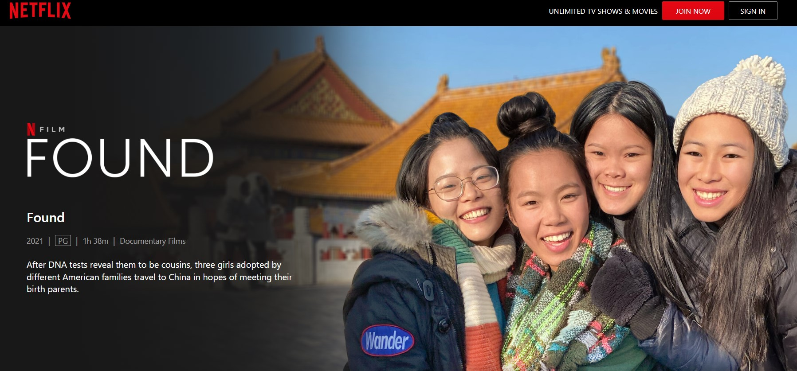

For this end of the year, I recommend the documentary “Found”. I found it very interesting and emotional.

It is a documentary that follows three young girls who were adopted as babies from an orphanage in China by people from Jerusalem, Nashville, Tennessee, and Oklahoma.

They know each other through Zoom and because after taking a DNA test, it turned out that they were cousins.

They decide to take a trip to China, together with their adoptive parents, and in China they are helped by a young woman, also Chinese, a genealogist, who is dedicated to helping adopted people find her biological parents.

**Mom, do you have any thoughts for this end of the year?**

I don't have anything specific that has to do with what is celebrated in December, but the following reflection comes to mind.

Here in Mexico, there are many people who are dedicated to helping you park or get out of the parking spot on the street. We call them “viene, viene” (keep coming, keep coming), because with that word they tell you if there is space to maneuver. And one gives them a few coins as a tip.

Even in such a simple occupation, you can tell who does the job with a nice attitude because they thank you with a smile, wish you a good day or night depending on the time, or give you blessings. I always thank them for their help because they do help me, and I let them know.

So, my reflection for this end of the year is that everything we do, however simple it may be, must be done with a nice attitude, and to the best of our ability. We must always do our best.
