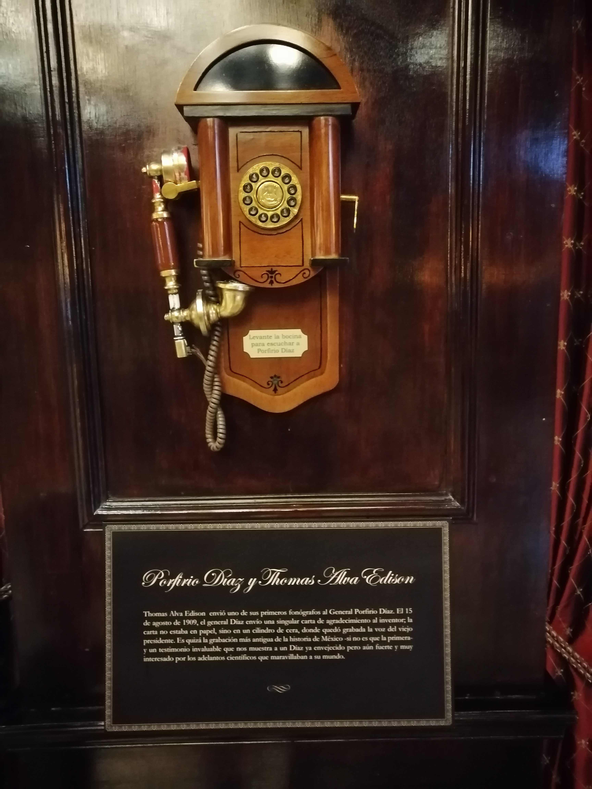

I visited Hotel Geneve, located at Calle de Londres 130, in Zona Rosa in Mexico City.

It was founded in 1907 by a Canadian of Irish descent, and an American woman, and decorated in classic European style.

This place introduced innovations in the hotel industry in many ways. The hotel has a collection of old telephones in the bar.

In one of them, you can hear a recording of Porfirio Díaz thanking Tomás Alva Edison for a telephone that he had gifted Porfirio.

We got a tour of the hotel, and it is like entering a time tunnel since it is also a museum. It has display cases that have objects from past times, as well as photographs of distinguished people who have stayed there at different times.

The hotel's original owners had it until 1970, and in 1991 it became part of Carlos Slim's Grupo Carson Hotel chain.

It is worth visiting. For more information about the history of the hotel: [Click here](https://www.hotelgeneve.com.mx/en/).

