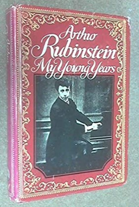

*When I read something that seems interesting to me, I copy it into a notebook I have, to keep those thoughts.*

*Going through that notebook to see if it had something that I thought was important to share, I came across these words that I think are wise, thought of by a very intelligent man. He wrote them at the end of his life when one has already analyzed everything in one’s life and only keeps what seems most valuable.*

*Arthur Rubinstein wrote a two-volume autobiography. In the first volume entitled “My Young Years” and published when he was 86 years old, he says:*

> **“Life can deprive us of freedom, of health, of fortune, of friends, of family, of success, but cannot take away from us our thoughts or our imagination, and there is always love, music, art, flowers, and books. And the passionate interest in everything.”**
