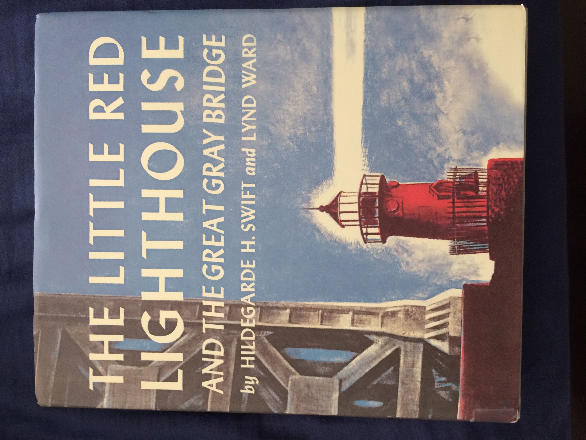
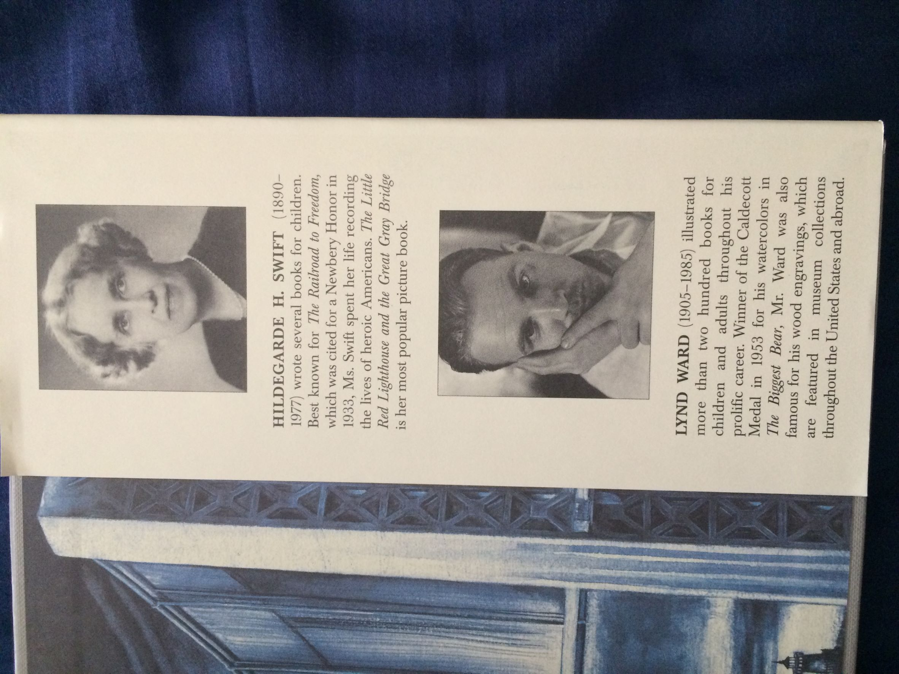
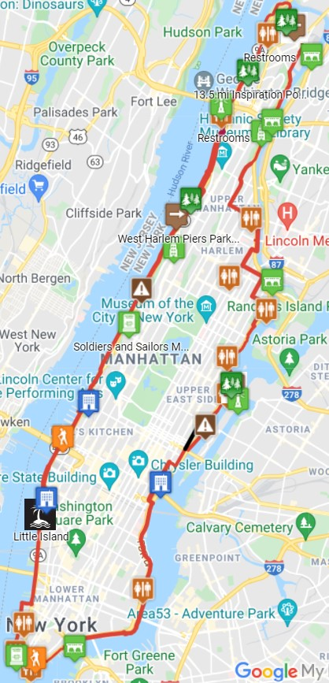

**How did you come up with wanting to walk the entire periphery of the island of Manhattan, and why?**

I like to walk and get to know places on foot. And Manhattan, in many places along the rivers, has walkways you can enjoy.

I like to be near the rivers and see the different types of boats go by. And I enjoy walking the different paths and discovering where they lead.

**How long did it take you to walk the whole way?**

I don't remember exactly, but my husband thinks it was like 4 days total, over several trips we made to NYC. Each time we restarted the route where we had left off the last time we were in the city.

**What do you think about the experience?**

I enjoyed it a lot and we saw very beautiful landscapes. For example, the area north of Battery Park, on the side of the Hudson River, is very nice.

**Who did you walk with?**

I walked with my husband. And here, I would like to tell you an anecdote:

We had reached the northernmost part of the island and were coming back on the side of the Hudson River, in an upper part where there is no walkway on the bank of the river.

As soon as we could, we went down, and I realized that we had left the Washington Bridge behind. I wanted to get to where I could be standing under the bridge.

My husband, already tired, decided to wait for me sited on a bench, while I walked the route I wanted.

When I was under the bridge, I saw something that I was very pleased to find: a small red lighthouse.

I walked over and found that it had an inscription. As I recall, the inscription was on the lighthouse, on a plaque with the data of the writer who had written a children's book with the lighthouse as the main character.

This lighthouse had been built in 1880 and was in Sandy Hook, NJ. And in 1921 it was moved to Fort Washington Park. It became the Jeffrey's Hook Lighthouse, and it was the only lighthouse on Manhattan Island.

In 1951, when it was supposed to be demolished because it was no longer in operation, it was ceded to the city of New York instead, thanks to public outcry, editorial pages in The New York Times, and I also understand thanks to the publication of the children's book.

With time and given that it had not been in operation for a while, it deteriorated. Thirty years later it became part of the National Register of Historic Places.

The lighthouse was restored in 1980 and in 2002, on the 60th anniversary of the book's publication, the lighthouse (which had been out since 1947) was given new lenses that made it shine on the waters of the Hudson River once again.

The book is titled: **The Little Red Lighthouse and the Great Gray Bridge**. The author is Hildegarde H. Swift and the illustrations are by Lynd Ward.

This book was first published in 1942.

It is worth visiting the lighthouse and I also recommend you buy the book.

