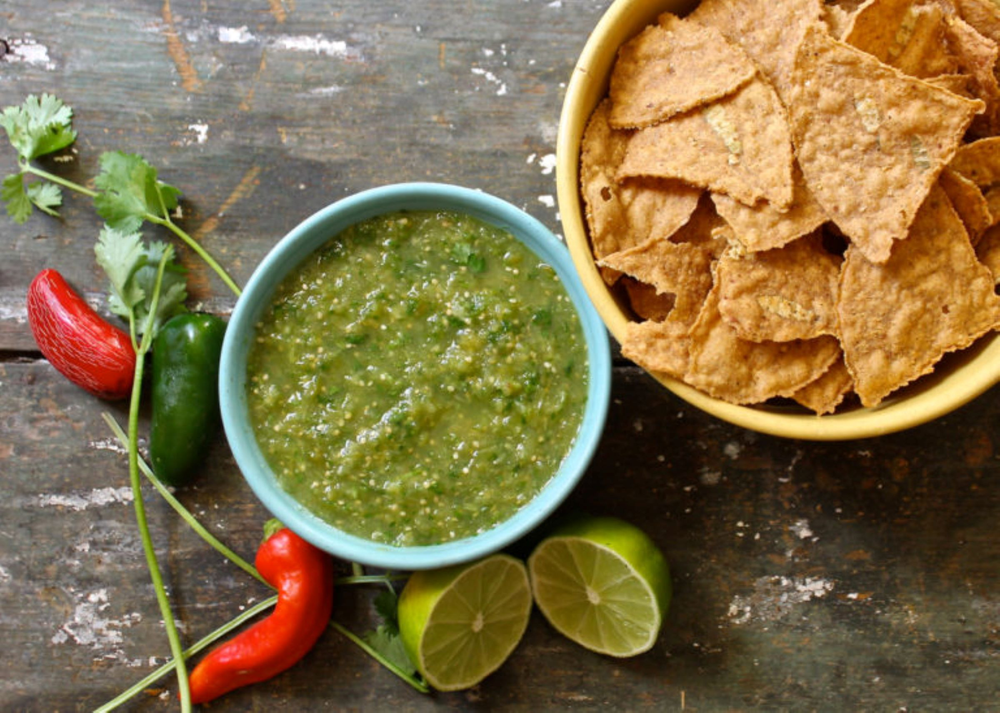

My contribution for this month is a green sauce.

**Ingredients:**

|  |  |
| ----------- | ----------- |
| Green tomatoes | 5 |
| Yellow tomatoes | 5 |
| Cilantro    | 1 bunch   |
| Serrano chili  | 1 |
| Avocados | 2 |
| Medium-sized onion | 1 |
| Salt | to taste |

**Directions:**

- Blend the tomatoes with the chili and cilantro with a little water.
- Empty in a container and add the chopped onion, the avocados in small squares and the salt.

