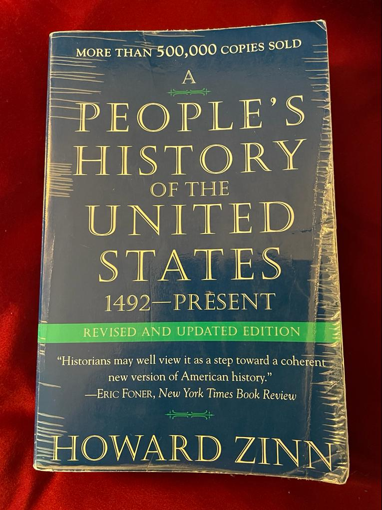

My recommendation for this month is the reading of the book “A People's History of the United States” by Howard Zinn.

It is a very interesting reading for everyone, but, I think, especially for US citizens, because it tells a different history than the one that has been taught. One that I find more credible.
