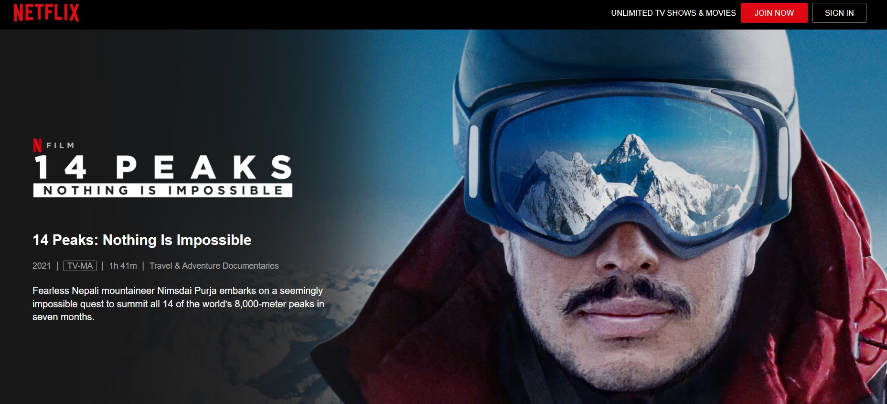

Para este mes mi recomendación es que vean el documental:

**“Los 14 ochomiles. No hay nada imposible”.**

Ese el título en español y está en Netflix.

En Estados Unidos es:

**“14 Peaks: Nothing Is Impossible”**

Es una historia muy inspiradora.

Y si quieren saber más del **Proyecto *Possible***, visiten el sitio web del alpinista del documental, Nimsdai Purja:

[Hagan click aquí para visitar el website](https://www.nimsdai.com/bremont-project-possible)
