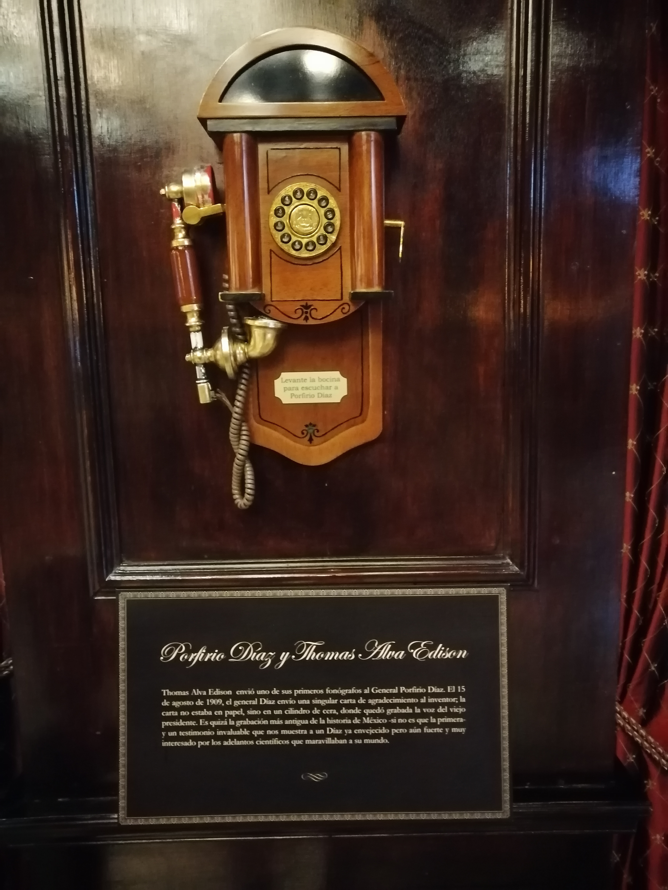

Conocí el Hotel Geneve, que está en la calle de Londres 130, de la zona Rosa de la CDMX.

Fue fundado en 1907 por un canadiense, de origen irlandés, y una americana y decorado al estilo clásico europeo.

Fue innovador en muchos aspectos en el ramo hotelero y tiene en el bar una colección de teléfonos antiguos.

En uno de ellos se puede escuchar una grabación de Porfirio Díaz dándole las gracias a Tomás Alva Edison por un teléfono que éste le había regalado.

Nos dieron un recorrido por el hotel y es como entrar en el túnel del tiempo, ya que también es museo, pues cuenta con vitrinas que tienen objetos de épocas pasadas, así como fotografías de personajes distinguidos que se han alojado ahí en diferentes tiempos.

Los dueños originales del hotel lo poseyeron hasta 1970, y en 1991 pasó a formar parte de la cadena hotelera del Grupo Carson de Carlos Slim.

Vale la pena conocerlo. Para mayor información sobre la historia del hotel: [Hagan click aquí](https://www.hotelgeneve.com.mx/es/).

