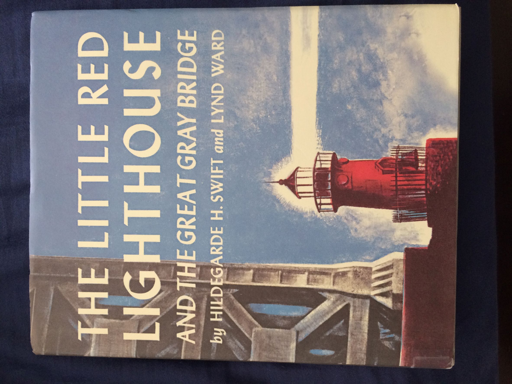
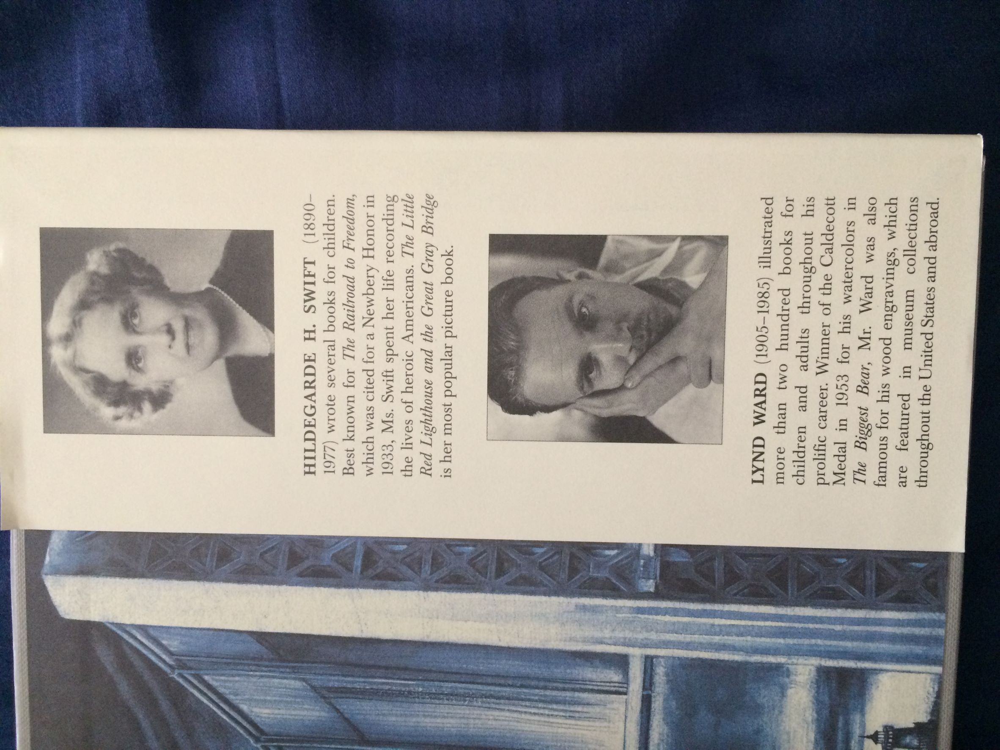
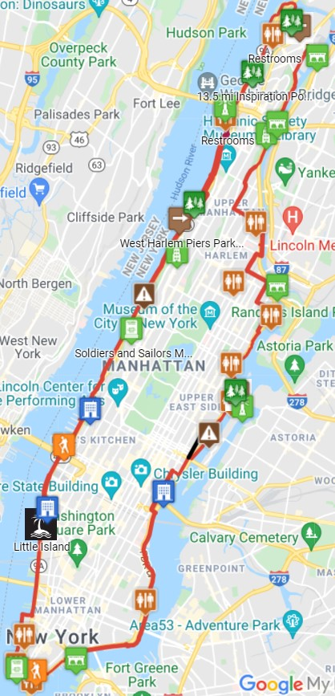

**¿Cómo se te ocurrió querer recorrer toda le periferia de la isla de Manhattan, y por qué?**

Me gusta caminar y conocer los lugares caminando y Manhattan, en muchas partes a la orilla de los ríos, tiene andadores por donde puedes pasear.

Me gusta estar cerca de los ríos y ver pasar las embarcaciones de distinto tipo y me atrae recorrer los caminos y descubrir a dónde conducen.

**¿Cuánto tiempo te llevó hacer todo el recorrido?**

No lo recuerdo con exactitud, pero mi esposo cree que fue como en 4 jornadas y en varios viajes. Reiniciábamos el recorrido en el lugar en el que lo habíamos dejado la última vez.

**¿Qué te pareció la experiencia?**

Lo disfruté mucho y vimos paisajes muy bellos. Por ejemplo, la zona hacia el norte de Battery Park, por el lado del río Hudson, es muy bonita.

**¿Con quién hiciste el recorrido?**

Con mi esposo. Y aquí, me gustaría contarles una anécdota:

Habíamos llegado a la zona más al norte de la isla y veníamos de regreso por el lado del río Hudson, en una parte alta donde no hay andador a la orilla del río.

En cuanto pudimos, bajamos y me di cuenta de que habíamos dejado atrás el Washington Bridge y yo quería llegar hasta estar parada abajo del puente.

Mi esposo, ya cansado, decidió esperarme sentado en una banca en lo que yo hacía el recorrido que quería.

Al llegar bajo el puente vi algo que me gustó mucho encontrar: un pequeño faro rojo.

Me acerqué y descubrí que tenía una inscripción. Según recuerdo, la inscripción estaba en el faro, en una placa con los datos de la escritora que había hecho un cuento para niños con el faro como personaje principal.

Este faro había sido construido en 1880 y estaba en Sandy Hook, NJ. En 1921 lo mudaron al Fort Washington Park convirtiéndose en el Jeffrey’s Hook Lighthouse, el único faro en la isla de Manhattan.

En 1951, cuando se tenían intenciones de destruirlo porque ya no estaba en funcionamiento, se le cedió a la ciudad de Nueva York gracias a las protestas del público, a páginas editoriales en The New York Times y tengo entendido que también gracias al cuento.

Pero al no estar en uso, se fue deteriorando. Treinta años después pasó a formar parte del Registro Nacional de Lugares Históricos.

Se restauró en 1980 y en 2002, en el 60 aniversario de la publicación del cuento, el faro (que había estado apagado desde 1947) fue provisto de nuevos lentes que lo hicieron brillar en las aguas del río Hudson una vez más.

El cuento se llama **The Little Red Lighthouse and the Great Gray Bridge**. La autora es Hildegarde H. Swift y las ilustraciones son de Lynd Ward.

Este libro fue publicado por primera vez en 1942.

Vale la pena visitar el faro y también les recomiendo comprar el libro.

