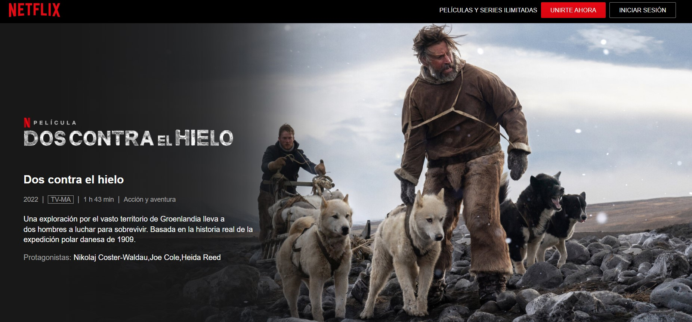

Para este mes recomiendo la película “*Dos contra el hielo*” - así le pusieron en español.

Está basada en un hecho de la vida real que se narra en el libro “*Two Against the Ice : A Classic Arctic Survival Story and a Remarkable Account of Companionship in the Face of Adversity*”. Lo escribió Ejnar Mikkelsen quien vivió eso que cuenta.
