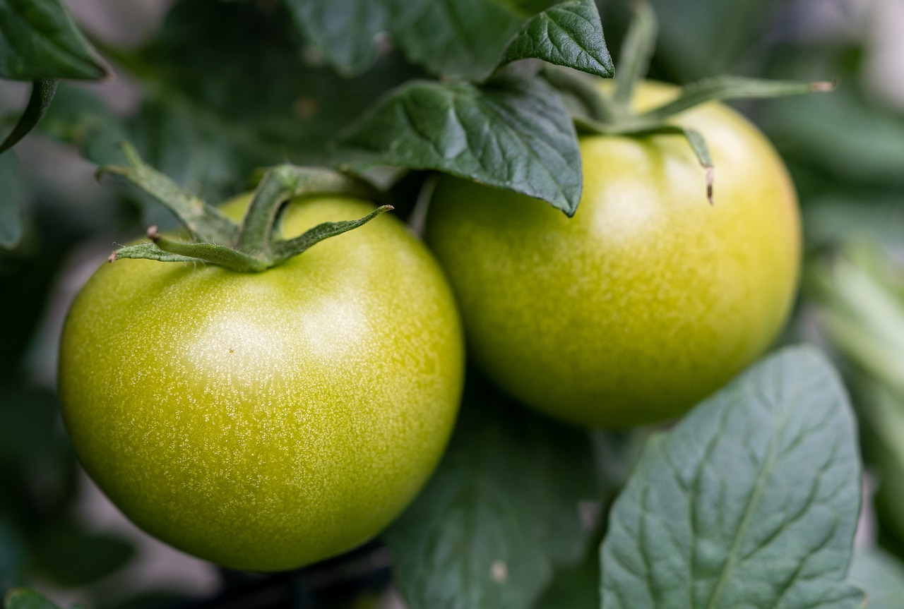
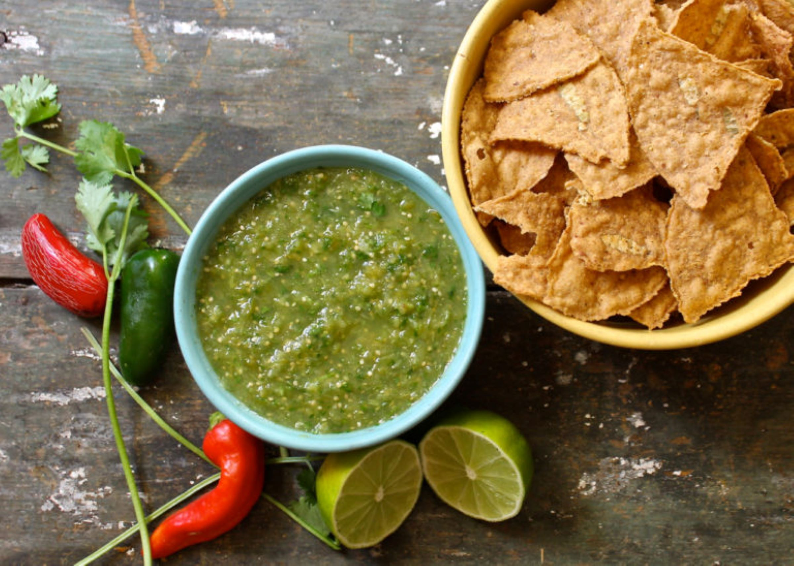

Mi contribución para este mes es una salsa verde.

**Ingredientes:**

|  |  |
| ----------- | ----------- |
| Tomates verdes | 5 |
| Tomates amarillos | 5 |
| Cilantro    | 1 manojito |
| Chile serrano  | 1 |
| Aguacates | 2 |
| Cebolla mediana | 1 |
| Sal | al gusto |

**Directions:**

- Licuar los tomates con el chile y el cilantro con un poco de agua.
- Vaciar en un recipiente y agregar la cebolla picada, los aguacates en cuadritos pequeños y la sal.

