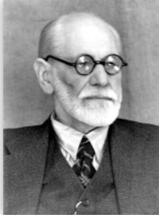

**¿Qué recomiendas este mes?**

*Esta parte de una carta que le escribió Einstein a Freud en un intercambio epistolar que sostuvieron.*

>“Estoy convencido de que casi todos los grandes hombres que, por sus logros, son reconocidos como líderes […] comparten los mismos ideales. Pero tienen poca influencia en el curso de los acontecimientos políticos. Casi parecería que el dominio mismo de la actividad humana más crucial para el destino de las naciones, está ineludiblemente en manos de gobernantes políticos totalmente irresponsables.”

**Y ahora dime por qué recomiendas leer esa cita….**

*Porque me parece una opinión interesante emitida por una persona considerada muy inteligente.*

*Con frecuencia siento que el futuro de la humanidad está en manos de los políticos y, en la actualidad, controlados por las grandes corporaciones. Y veo que les interesa más las contribuciones económicas que éstas dan a sus campañas que inclusive la salud del planeta.*

*Esto lo considero ya no solo una irresponsabilidad sino prácticamente una ceguera y me recuerda una ilustración que mi esposo usaba en sus cursos en IBM:*

*Están cuatro personas en una lancha que tiene un agujero en un extremo y se está hundiendo. Dos de ellos se dedican a sacar el agua que está entrando y los otros dos, sin hacer nada, solo comentan “qué bueno que el agujero está de su lado”.*

