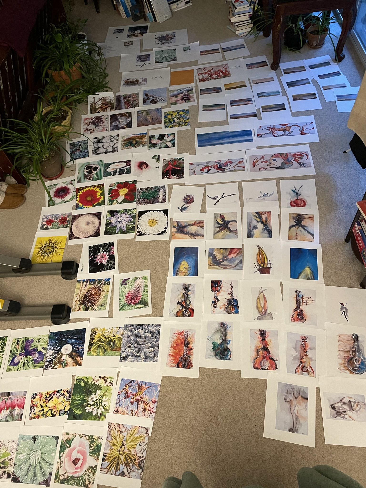

I already wrote the introduction to our book and decided to create a new order to present our paintings and photographs.

I had to print what we had to see how I was going to reorder all the images.

This was what my carpet looked like the other day:

