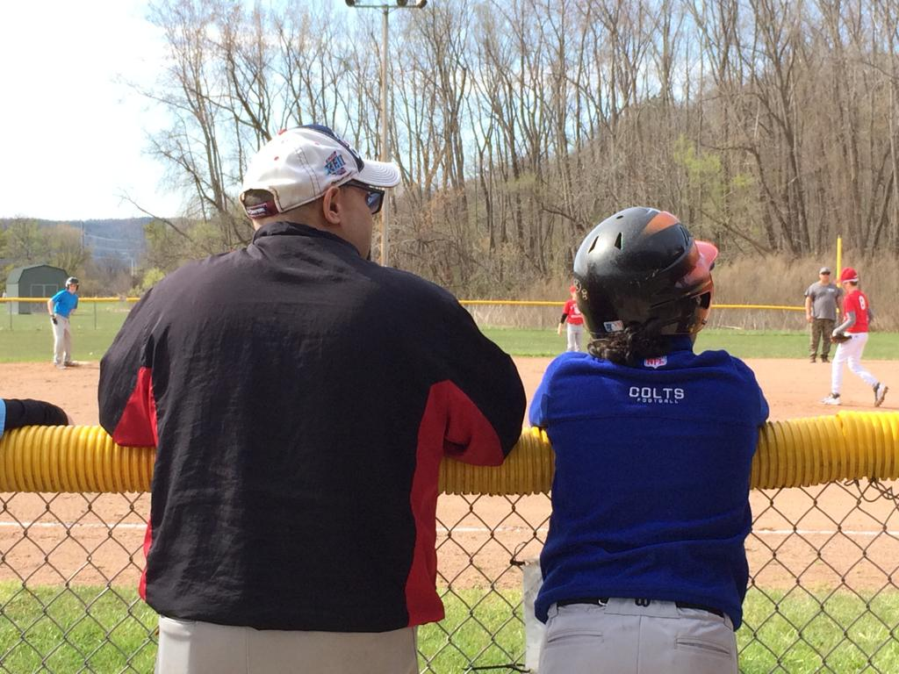
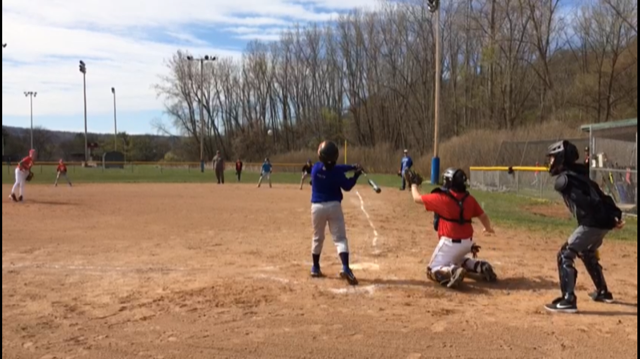
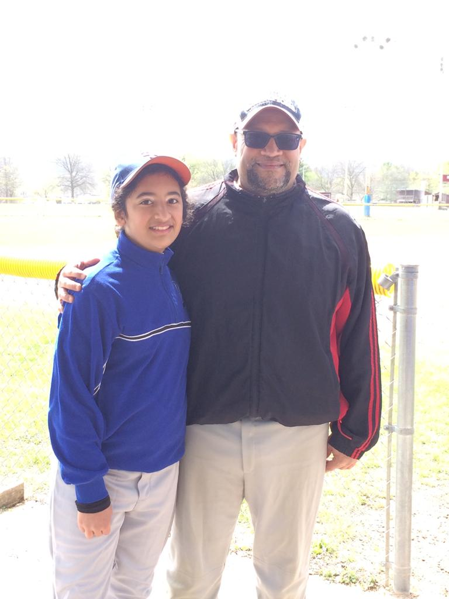

Baseball is back!  Maya is playing in the Ithaca Cal Ripken Little League!

***Maya***: On Saturday, April 23, 2022, I played my first baseball game in the Ithaca Cal Ripken Little League. I really liked it a lot. And the best thing of all is we won the game by a score of 8 - 5!  I was very excited to play against another team for the first time. My positions were 2nd base, Right Field, and Designated Hitter (DH) in the game. Even though I was the only girl on the team, I felt supported by my teammates.  I had trouble with hitting, but at one point, I made contact! It was a foul ball, but still! It's hard. Then I even walked (bases on balls or BB), scored my first run, and helped the team win!  When I was on the field, playing defense, I did not get one ball hit my way, and I wish it had been, but it was fun regardless, and I can't wait until our next game!  

***Carlos***: Maya played her first little league baseball game, and I returned to coaching after almost 30 years! I am a proud papa of a superb athlete! Maya is strong, fast, and a quick learner.  I was so nervous and excited to see Maya play along with her teammates in her first-ever game against apparently one of the stronger teams in the league.  But we won!!  It was a total team effort. The players and the coaches did an excellent job not only staying focused pitch-by-pitch but also teaching & learning new things about the great game of baseball. We have an eight-game regular-season schedule and another three-game playoff.  Maya's team is called The Blues. However, the name may change soon. The Blues is one of five teams in the league.  I hope you follow our team's progress in the next few weeks!  Stay tuned for more baseball with Maya at the center of the adventure!

