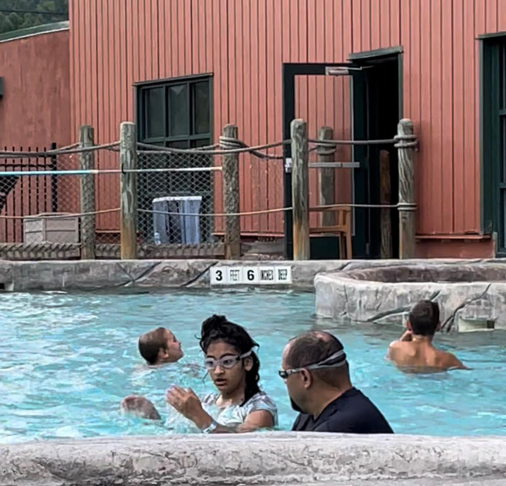
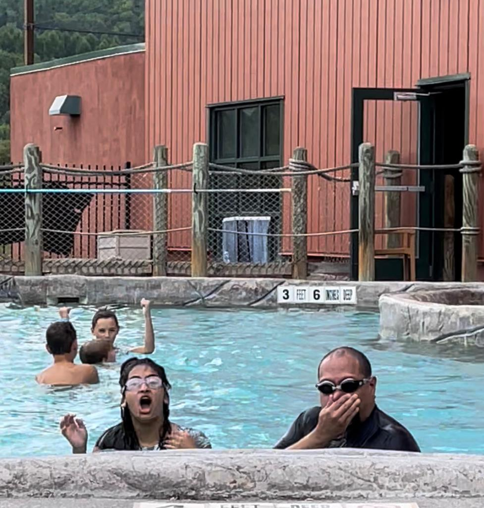

***Carlos***: We went to the Greek Peak Water Park and Mountain Resort in Cortland, New York.

I enjoyed the indoor-outdoor Pool, whirlpool, and cascade slides too. Maya and I swam in the giant wave pool for hours.

We enjoyed our second trip to Greek Peak; we visited about the same time last year.

However, this time, we did not stay in the resort but instead made it a day trip. We stayed for 6 hours!

It was fun relaxing and playing with Maya on the water rides without worrying about anything else.

I think this is what a day trip should be like: great fun, joyful play, eating junk food, laughing, and chatting freely.

We hope to return in October for the Greek Peak Halloween festivities!

***Maya***: Our Moment of the Month was going to Greek Peak on a day trip.

We first went on the mountain coaster three times in a row!

Then we went straight to the indoor water park. We went on rapids 4 and 5. That was the first thing we did when we got there. Those are the highest water slides in the park, and they were so cool 😎!

We swam in the wave pool for a while and also swam in the outside pool that was heated.

We even went into the hot tub, and it felt great!

Fun 🤩 is the name of the game!

I recommend going to Greek Peak and staying in the resort (like we did last year).

