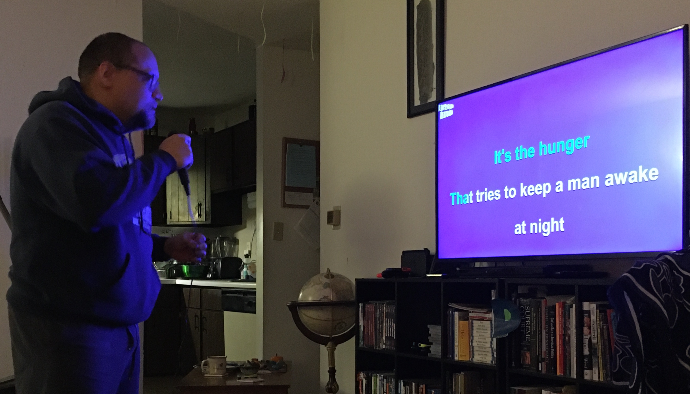

***Maya***: In January, we did a *Figueroa Karaoke Challenge*. It was really fun. It was homemade. We did eight rounds, four rounds each, and sang random songs picked out of a hat! We selected this as The Moment of the Month because it was one of the few times we could sing together. Even though we were embarrassed, we had lots of fun together.

***Carlos***: That is right, we sang our hearts out even though we often sang off-key and said the wrong lyrics, oops! We judged ourselves based on lyrics, intonation, and melody. It was challenging to sing a 2013 teen pop song one minute ("Victorious" Nickelodeon show) and then a 1980s *hip hop or rap song* the next ("The Breaks" by Kurtis Blow). We plan to do this again soon with more strange or obscure songs across more genres. We may even include Spanish language songs to make it even more challenging! Maya won this competition 80 points to 70.75 points out of 120 points!

