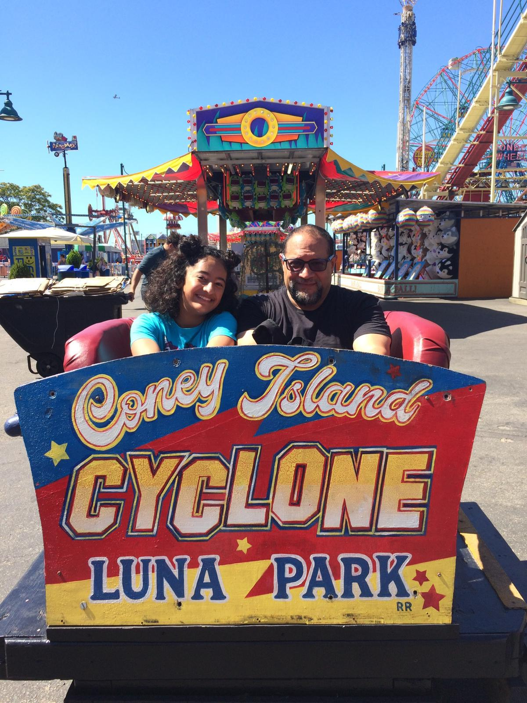
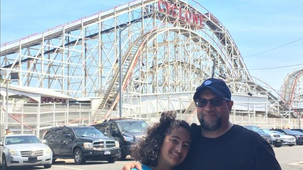
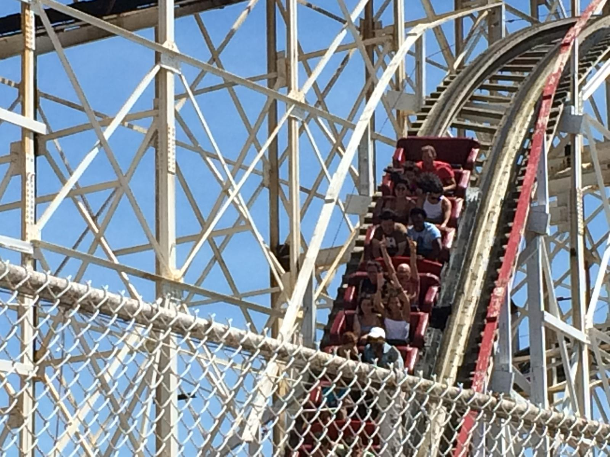

***Maya***: Last month, mama, papa, and I went to Coney Island's Luna Park and had a blast!

The first thing we did was go on the famous Cyclone Roller Coaster! It was only papa and me because mama didn’t want to do it.

It was the scariest roller coaster I’ve ever been on! I was traumatized!
But then we went on some other roller coasters to calm down and had so much fun.

We didn’t eat well before we had to go, so we were really dizzy. So we decided to go and eat. I was feeling weird, so I only ate a gelato, but my mom ate a corn dog, and my dad ate a hot dog.

After that, we went on some bigger and more fun rides. My dad and I went on the free fall tower, and I went on a bigger and scarier version of the flying chairs.

After all that, the last thing we did was go on the Cyclone again because I wanted to get rid of my fear. So we ran to it as fast as we could, and we made it three minutes before our time there was up.

The first time I sat alone, I sat with papa this time, and it was the best thing ever! And now I can proudly say that I went on the Brooklyn Cyclone!

***Carlos***: One of the things I have wanted to do ever since Maya was born was to take her to Coney Island in Brooklyn, NY, a place I hold dear to my heart.  I can now take that off my bucket list!  

Well, I was finally able to keep my promise, and this month take Maya (with Lucía) to Coney Island.  

Over the years, I have talked to Maya about my childhood days in the 1970s and early 1980s, spending it at the beach in Coney Island and going to what was then called Astroland.  

Back then, the most famous roller coaster on Earth, the Cyclone, was my first ever experience of excitement, fear, terror, and amusement all at the same time!  

Going on that roller coaster for the first time at age six (how I was allowed, who knows!) was incredible (I got on it twice in a row on my first trip!).  

Most impressively, Maya and I boarded the Cyclone twice! We also went on other rides, the Brooklyn Flyer and the Electro Spin (Disk’O), for instance.

We had a blast, as Maya said, although I did injure myself (Achilles tendinitis) while walking with my new Crocs.  

But, the most important thing is that Maya finally got to experience one of my childhood hot spots and favorite roller coasters.  

It was worth the wait!

