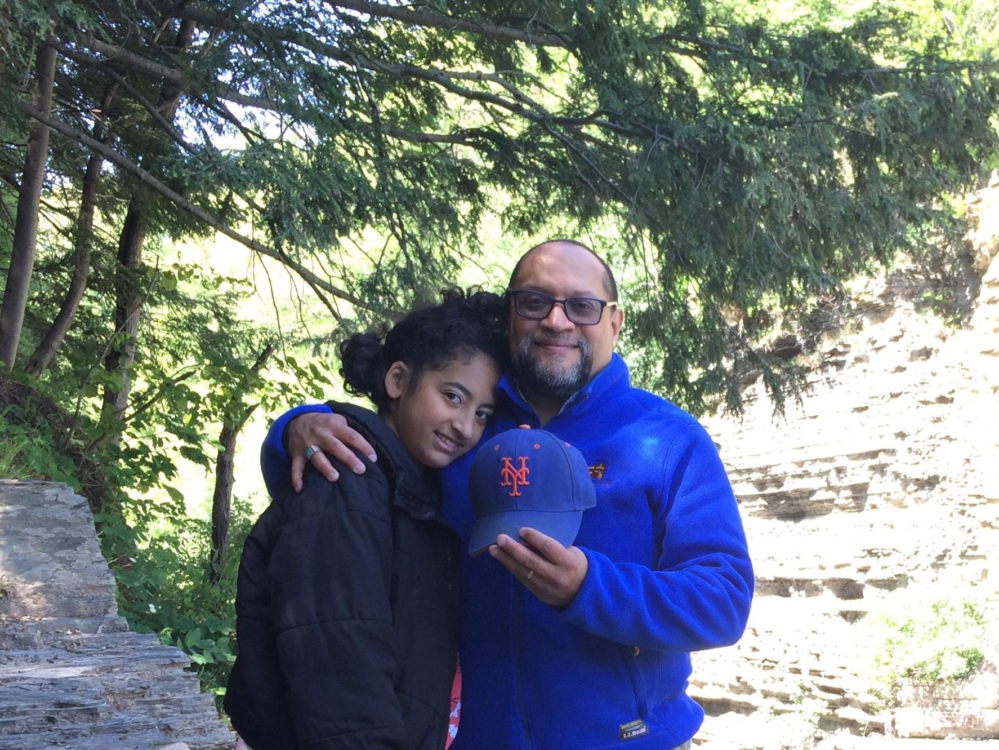
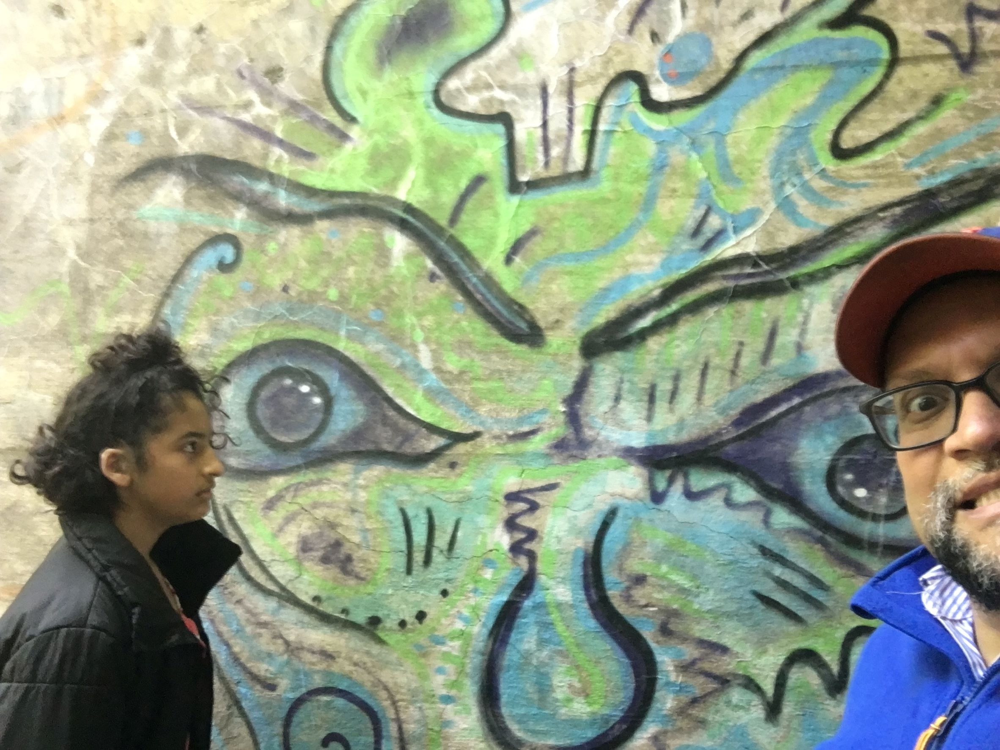

***Carlos***: The moment of the month of June is FATHER'S DAY!

It was one of the most memorable Father's Day celebrations I have ever had since becoming a father officially in February 2010. Maya and Lucía treated me like an Ithaca king, allowing me to make all the decisions without compromises. That is a father's dream!

I chose a relatively new diner restaurant called *Milkstand* for breakfast. While waiting for a table, we walked around the restaurant's neighborhood and found a small green park. At the park, we watched Maya do gymnastics and surveyed the various old late 19th and early 20th Century houses across the street. We enjoy talking about architecture, especially homes. The day was sunny and warm.

Upon returning to the restaurant, our table was ready for us. I ordered traditional buttermilk pancakes with bananas, tea, two eggs sunnyside up, classic pork sausage links, and orange juice. The waiter was friendly and kind. It was nice, with several families eating, laughing, and chatting. Overall, it was an excellent environment.

After breakfast, we headed to Six Mile Creek in South Hill near Ithaca College. This area has multiple trails and lots of verdure, full of birds, squirrels, chipmunks, raccoons, and other earth creatures roaming in the woods. Wildlife is well at the Creek!

One of my goals for that day was to take Maya and Lucía up to the Second Dam on the other side of the Creek, where people (Ithaca College students especially) go sunbathing, swimming and cliff jumping. It worked out because I reluctantly asked a passerby (Lucía suggested I ask a man walking in the opposite direction) if he could point us in the right direction to the Dam. I vaguely remembered the path because the last time I visited the Dam was about six years ago when I used to run there with my trainer at least once a week. The man eagerly and kindly walked us to one of several paths that would take us to the Dam. We thanked him, and we went to explore the ups and downs of the scary wooded path. It took us around 20 minutes to make it to the Dam because the course was not easy to navigate. It included rough terrain, tree roots, sandy pebbles, a small creek to cross, and various rocky, hilly areas to hike.

Maya took the lead and did well managing the path. I accidentally squashed a Spongy moth (Lymantria dispar, formerly the European gypsy moth) with my right hand while grabbing hold of a tree trunk, yuck! I want to think this means I'll have luck on my side for the rest of the year! After making it to the Dam, we saw a guy jump twice off the 50-foot tall cliff while a young woman sunbathed below. It was exciting and scary to see him jump. One day I might consider taking that jump, perhaps on my 60th birthday! Or maybe not!

At the end of the night, we ordered Vietnamese Food at *Saigon Kitchen* and went home to watch Jackie Chan's 2004 movie *Around the World in 80 Days*. We did not get to finish the film, and we hope to finish it before the end of the month!

***Maya***: On Father's Day, we went to this new restaurant called Milkstand. It's a cool diner with delicious food and milkshakes. I ate waffles with sausage on the side and a vanilla milkshake. It was so good!

After that, we drove to Ithaca College to go to the bathroom.

We then decided to go to the Ithaca College trails. So when we got there, we started walking. When we made it to the playground in the middle of the trail, I ran to it. We spent a little bit more time there and continued walking.

We then went to the second Dam, but it took a while to walk there. The trail that led to the Dam was hidden. We asked a guy we saw to show us where the trail was, and he was nice enough to start us off so we could find our way.

On the way there, we walked on super steep hills going up and down, so we had to be super careful both ways.

Some people say the kids are the ones who usually get scared of those things, but surprisingly, Papa was the one who was scared! Haha!

On the way back, when we were about two miles away from our car, I started running and beat my parents, including Papa, even though it was Father's Day.

