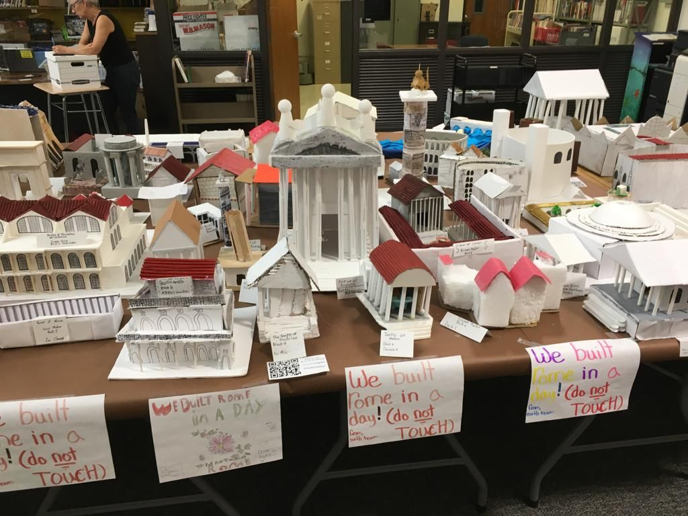

***Maya***: I made a project for Social Studies.

We had to **Build Rome in a Day**. I made the Forum of Augustus.

I went to a friend’s house to work on the project and had fun, but after we had to fix most of it because I messed it up. In the end, it all turned out well.

I spent more than 5 hours building it with Papa. It was fun but it was also frustrating sometimes because I kept missing a piece or putting it in the wrong place, and we both got mad at each other.

But overall, it was a good learning experience and a good way to learn how to work with other people.

***Carlos***: This month Maya had a fantastic project to construct: a model of the Forum of Augustus.  

The forum was a significant part of the ancient city of Rome.  

It was a challenging and tedious process to complete with many moving parts, columns to build, and stairs to assemble made of foam, glue, straws, cardboard, and tape as the primary materials.  

My job was to help Maya make the project as realistic as possible and as unique as it could be!  

Despite the challenges of finding the best way to build this major part of Rome, we persevered, and as you can see from the photos, it turned out incredibly well!  

We learned a great lesson about patience, paying attention to details, and how to work collaboratively.  

I am so proud of Maya for doing an amazing job on this project!  

She helped build Rome in a day!

