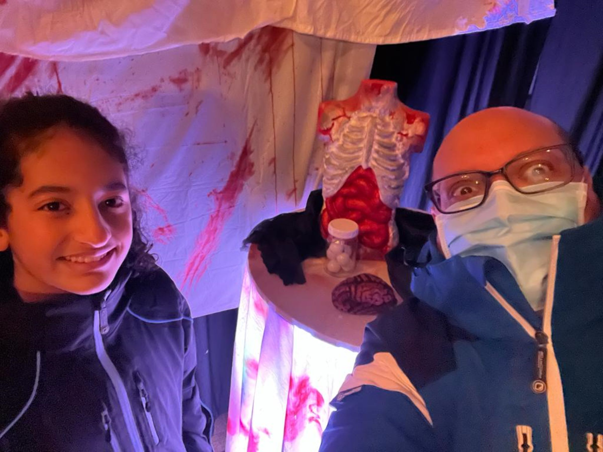
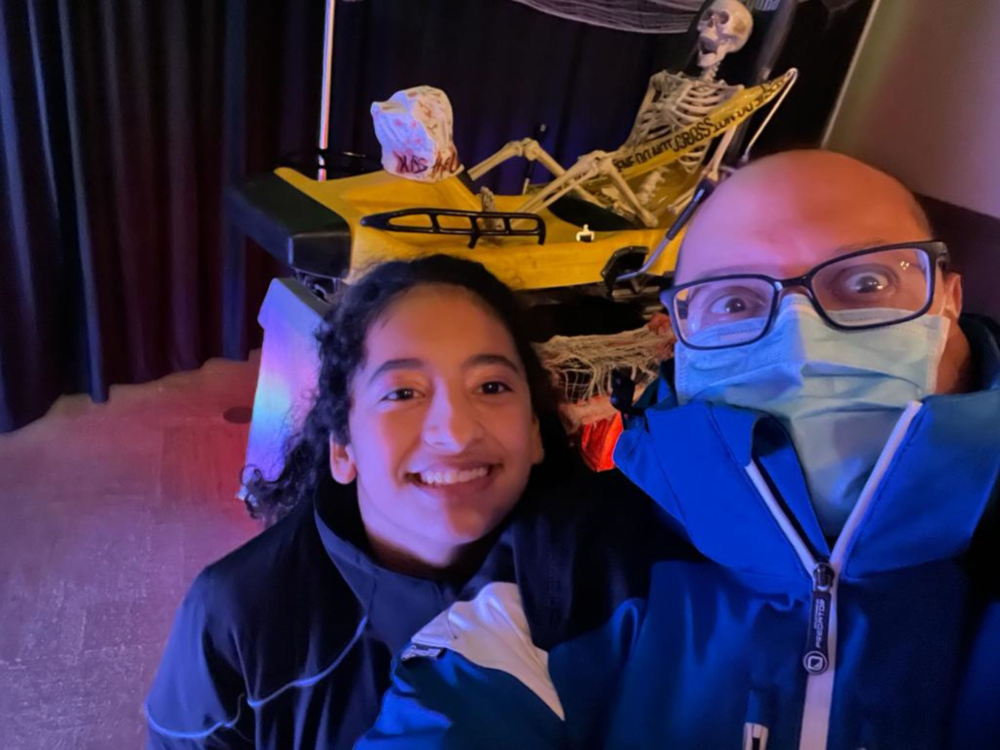
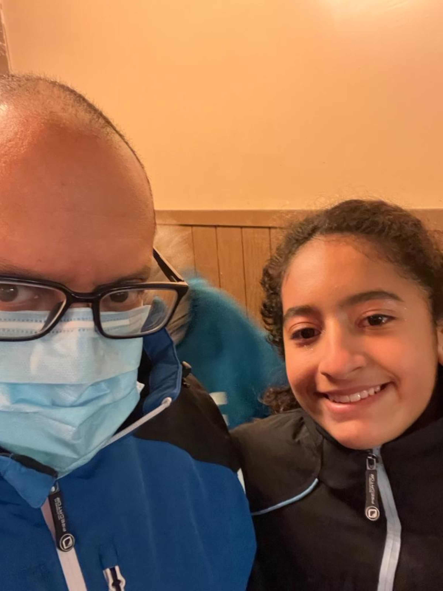

***Maya***: Our moment of the month is Greek Peak, again!

I always like going there and going to the water park, the zipline, and the mountain coaster. But we only went for the mountain coaster because it was Halloween time, and they made the ride scarier.

At first, I was terrified, even before we walked into the building.

Still, as I got used to the decorations and what was around me, I started getting excited.

We walked through the first line, and at the end, there was a woman who told us all the rules for the ride.

After that, we got in line for the actual ride. In the little room we walked into, there were missing people signs all over the place and some zombies and skeletons in the corners.

While there, we heard screaming from the room ahead, and I was curious.

When we got to the final room (still in the line), it was so loud, with hanging body parts and people cooking organs in the oven. People with bloody aprons on the track above us were banging on the coaster cars with hammers and pots, making loud noises.

It was fun but not as scary as I wanted it to be.

So was the ride.

We went on two times, and it was freezing cold because we were going super-fast in 30-degree weather, making it even colder.

After the first ride, we drove to the resort to get some French fries and root beer.

Then we went on the mountain coaster again.

Overall, I'm glad we went to Greek Peak for Halloween weekend!

***Carlos***: This moment of the month for October is no surprise!

Since Maya and I love ghoulish things and Halloween, we decided to do something different besides going trick-or-treating (that comes later!).

We chose as our moment our most recent visit to Greek Peak and our experience with the haunted Mountain Coaster.

It was an exciting experience because this was our first time riding a haunted outdoor coaster!

Maya and I froze in 32-degree Fahrenheit weather but eventually enjoyed our visit.

We rode twice within 3 hours for two reasons: the cold weather (it kept getting colder and colder) and the longish entrance lines.

There were no jump scares, which surprised us because we expected those.

Several scary zombies were spread out throughout the main building in the waiting area, and at the coaster track edges.

As we rode on the coaster, strange-looking people whispered or made odd noises. It was challenging because I had been with a cold for three days and decided to gut it out for Maya's sake.

I had to rest as much as possible, getting my body ready to take the trip and then get on the coaster for the thrills and chills!

Thanks to Lucía, I did not have to drive to Greek Peak because she volunteered to do so both ways, even though she did not get on the coaster.

Overall, as you can see from the photos, we had a lovely time despite the cold winds in the mountain and my physical condition.

On to the next Halloween adventure and eating candy!

