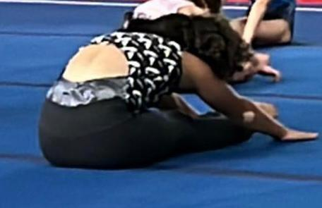
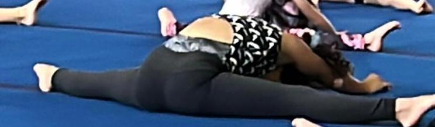
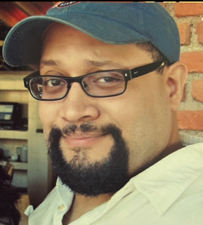
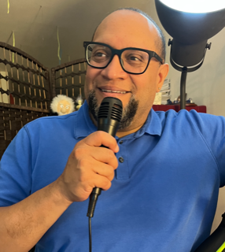
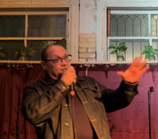

***Maya***: I am part of the gymnastics team!

I was in the pre-team, and we had to pass different skills to get to the team, and I did it. I am on the team! Now we get to compete and learn different skills. I am on level 2. In the competitions, it’s kind of against other people but it’s mainly against your own best.

I am excited to be on the team!

***Carlos***: My moment of September is that I finally made my standup comedy debut on September 6, 2022! It was nerve-racking but fun. I invited a few friends for some support.

I had been waiting to do this for over 35 years or so.

I promised Maya I would do this about four years ago, and now I have done it.

I prepared for this September moment in January of this year when I attended several online comedy writing workshops with The Joke Doctor, Jerry Corley, a long-time comedian out of Hollywood, CA, and late-night comedy writer for the Tonight Show, among others.

In January, I officially started my process with the comedy writing workshops, participating in Facebook comedy groups, and since then have been writing jokes or bits every day.

I most recently created a social media presence to share some of my work, as I plan to return to the stage sometime in the next few months.

Moving forward, I plan to balance academic, research, and writing life with my comedic side. I plan to become perhaps the first person to successfully be asked to discuss policy controversies and political issues one night and then headline a comedy show the next night!

Please follow and share my work! I go by Dr. C-Los, Comedian!

Check out my social humor and dark comedy here:

[TikTok](https://www.tiktok.com/@drc_los_comedian?is_from_webapp=1&sender_device=pc)

[YouTube](https://www.youtube.com/channel/UCeIRL3zFrQHJxSWnD3nvitQ/featured)
