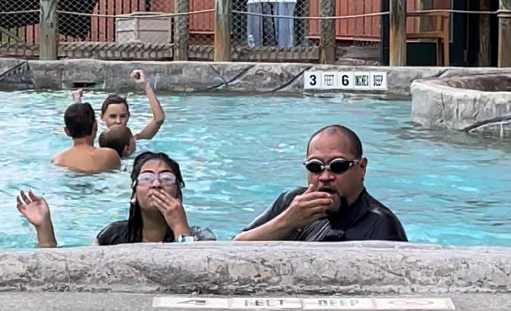
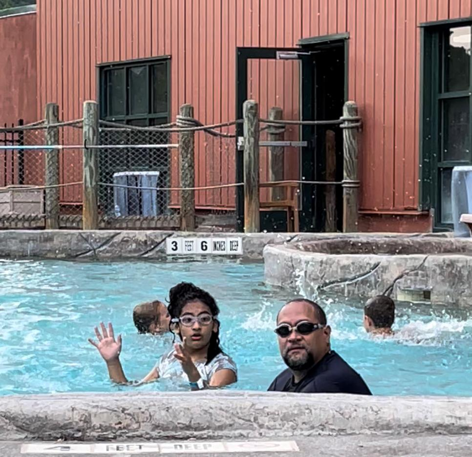
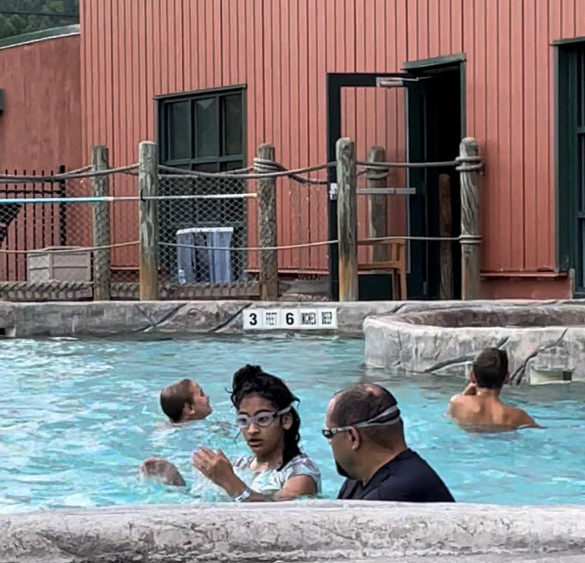
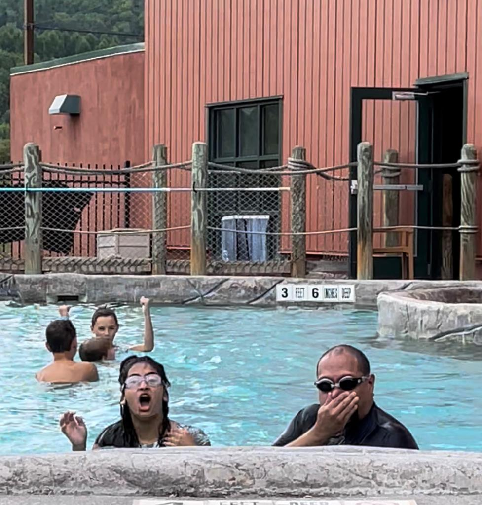

***Carlos***: Fuimos al parque acuático del hotel de Greek Peak en Cortland, Nueva York.

También disfruté de la piscina cubierta y de la que está al aire libre, la tina de hidromasaje y los toboganes.

Maya y yo nadamos en la piscina de olas gigantes durante horas.

Disfrutamos de nuestro segundo viaje a ese lugar (lo visitamos en el verano del año pasado).

Sin embargo, esta vez, no nos quedamos en el hotel, sino que hicimos un viaje de un día.

¡Nos quedamos 6 horas!

Fue divertido relajarse y jugar con Maya en los juegos acuáticos sin preocuparnos por nada más.

Creo que así es como debería ser un viaje de un día: muy divertido, con juegos alegres, comer comida chatarra, reír y conversar libremente.

¡Esperamos volver en octubre para las festividades de Halloween de Greek Peak!

***Maya***: Nuestro *Momento del mes* fue ir al Greek Peak en un viaje de un día.

¡Primero, nos subimos a la montaña rusa tres veces seguidas!

Luego fuimos directamente al parque acuático cubierto. Bajamos por los toboganes 4 y 5. Eso fue lo primero que hicimos al llegar. Esos son los toboganes de agua más altos del parque, ¡y son muy divertidos! 😎

Nadamos en la piscina de olas por un rato y también nadamos en la piscina exterior que estaba calientita.

Incluso entramos en el jacuzzi, ¡y estuvo genial!

¡Diversión 🤩 es el nombre del juego!

Recomiendo ir a Greek Peak y hospedarse en el hotel (como hicimos el año pasado).

