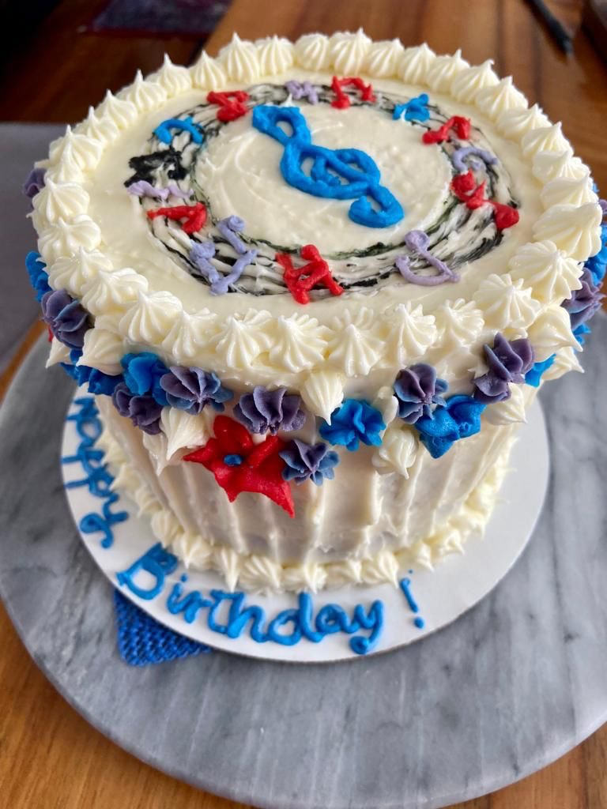

¡Este mes Maya y yo celebramos nuestros cumpleaños con estilo!

¡Ordenamos dos deliciosos pasteles de zanahoria, uno para cada quien, con decoraciones sorpresa únicas de Vasantha, una excelente repostera de Ithaca, Nueva York!

Maya y yo elegimos nuestras respectivas celebraciones de cumpleaños como El momento del mes por dos razones:

1) nos encanta el pastel de zanahoria, y 2) el pastel de zanahoria era el pastel favorito de mi Mami, Virginia Morales (la abuela paterna de Maya). Compartíamos el mismo cumpleaños (1 de febrero). Ella falleció, a principios de mayo de 2015, a la corta edad de 66 años.

¡La extrañamos mucho!

Entonces, en honor a mi Mami, el pastel de zanahoria será de ahora en adelante nuestro tradicional pastel de cumpleaños.
¡Disfruten también de nuestras fotos!

