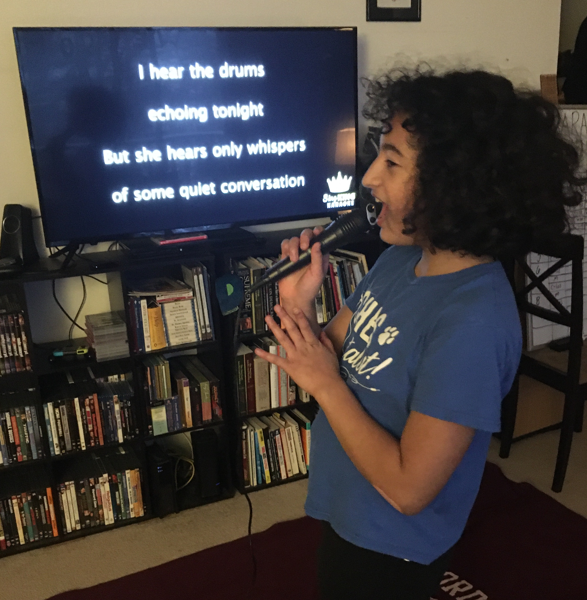
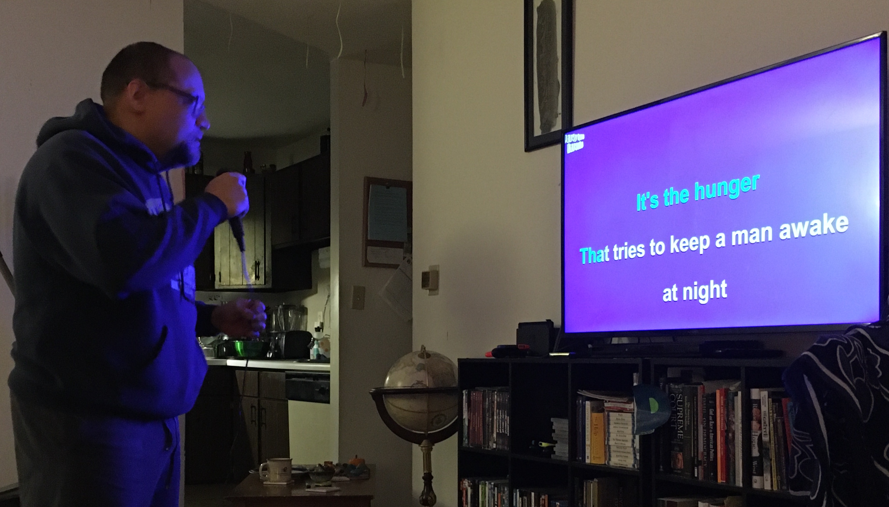

***Maya*:** En enero hicimos un reto llamado “El karaoke Figueroa”. Fue realmente divertido. Hecho en casa. ¡Hicimos ocho rondas, cuatro rondas cada uno, y cantamos canciones al azar sacadas de un sombrero! Seleccionamos esto como “El momento del mes” porque ha sido una de las pocas veces que hemos podido cantar juntos. Aunque nos dio un poco de pena, nos divertimos mucho juntos.

***Carlos*:** Así es, cantamos con todo nuestro corazón a pesar de que a menudo cantábamos desentonados y decíamos la letra equivocada, ¡ups! Maya me juzgó a mí y yo la juzgué a ella basándonos en la letra, la entonación y la melodía. Fue un reto cantar una canción pop adolescente del 2013 un momento ("Victorious" del programa de Nickelodeon) y luego cantar una canción de hip hop o rap de los 80s al siguiente ("The Breaks" de Kurtis Blow). Pronto planeamos hacer esto nuevamente con más canciones extrañas u oscuras a través de más géneros. ¡Incluso podemos incluir canciones en español para hacerlo aún más desafiante! ¡Maya ganó esta competencia con 80 puntos contra 70.75 (míos) de un total de 120 puntos!

