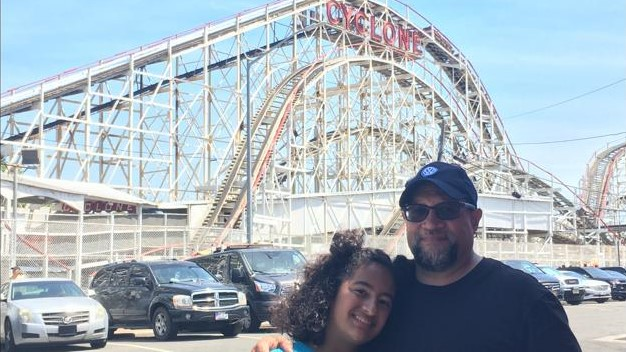

***Maya***: ¡Este mes, mi mamá, mi papá y yo fuimos al Luna Park de Coney Island y lo pasamos genial! ¡Lo primero que hicimos fue subirnos a la famosa montaña rusa llamada Cyclone! Solo éramos mi papá y yo porque mi mamá no se quiso subir.

¡Fue la montaña rusa más aterradora a la que me he subido! ¡Estaba traumatizada! Pero luego nos subimos a otras montañas rusas para calmarnos y nos divertimos mucho.

No comimos bien antes de subirnos, así es que estábamos muy mareados. Entonces decidimos ir a comer. Me sentía rara, y por eso solo me comí un helado, pero mi mamá comió un corndog y mi papá un hotdog.

Después de eso, nos subimos a otros juegos más grandes y divertidos.

Mi papá y yo nos subimos a la torre de caída libre, y yo me subí a una versión más grande y aterradora de las sillas voladoras.

Después de todo eso, lo último que hicimos fue volver a subir al Cyclone porque quería quitarme el miedo.

Así que corrimos hacia allá lo más rápido que pudimos, y logramos llegar tres minutos antes de que se acabara nuestro tiempo en el parque de diversiones.

La primera vez, me senté sola, pero esta vez me senté con mi papá, ¡y fue lo mejor de todo!

¡Y ahora puedo decir con orgullo que me subí al Cyclone de Brooklyn!

***Carlos***: Una de las cosas que he querido hacer desde que nació Maya era llevarla a Coney Island en Brooklyn, Nueva York, un lugar que aprecio mucho en mi corazón.

¡Ahora puedo quitar eso de mi lista de deseos!

Bueno, finalmente pude cumplir mi promesa y este mes llevar a Maya (y a Lucía) a Coney Island.

A lo largo de los años, he hablado con Maya sobre mis días de infancia en la década de 1970 y principios de los 80s, cuando íbamos a la playa de Coney Island e a lo que, en ese entonces, se llamaba Astroland.

En esos tiempos, la montaña rusa más famosa de la tierra era el Cyclone.

Fue mi primera experiencia de emoción, miedo, terror y diversión, ¡todo al mismo tiempo!

Subirme a esa montaña rusa por primera vez a los seis años (¡cómo me permitieron entrar! ¡quién sabe!) fue increíble (¡me subí dos veces seguidas en mi primer viaje!).

¡Lo más impresionante es que Maya y yo nos subimos al Ciclón dos veces! También nos subimos al Brooklyn Flyer y al Electro Spin (Disk'O).

Como dijo Maya nos lo pasamos de maravilla, aunque yo me lesioné (tendinitis de Aquiles) mientras caminaba con mis nuevos Crocs.

Nos lo pasamos genial, como dijo Maya, aunque yo me lesioné (tendinitis en el talón de Aquiles) por haber caminado con mis nuevos Crocs.

Pero, lo más importante, es que Maya finalmente pudo tener una de las mejores experiencias de mi infancia y subirse a mi montaña rusa favorita.

¡Valió la pena la espera!

