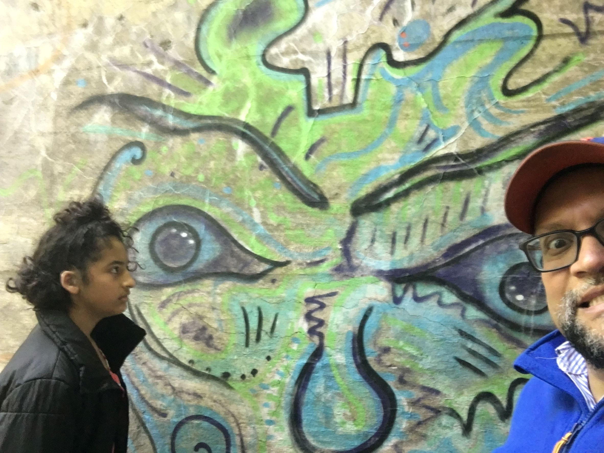

***Carlos***: ¡El momento del mes de junio fue el DÍA DEL PADRE!

Fue una de las celebraciones del Día del Padre más memorables que he tenido desde que me convertí en padre oficialmente en febrero del 2010. Maya y Lucía me trataron como un rey de Ítaca, permitiéndome tomar todas las decisiones sin compromisos. ¡Ese es el sueño de un padre!

Elegí un restaurante relativamente nuevo llamado *Milkstand* para el desayuno. Mientras esperábamos una mesa, caminamos por el vecindario y encontramos un pequeño parque. Ahí, vimos a Maya hacer gimnasia e inspeccionamos varias casas antiguas de finales del siglo XIX y principios del XX al otro lado de la calle. Nos gusta hablar de arquitectura, especialmente de viviendas. El día era soleado y cálido.

Al regresar al restaurante, nuestra mesa estaba lista. Pedí hotcakes tradicionales de suero de leche con plátanos, té, dos huevos estrellados, salchichas de cerdo clásicas y jugo de naranja. El mesero fue atento y amable. El restaurante se sentía muy agradable, con varias familias comiendo, riendo y charlando. En general, fue un ambiente excelente.

Después del desayuno, nos dirigimos a *Six Mile Creek* en South Hill, cerca de Ithaca College. Esta área tiene múltiples senderos y mucha vegetación, llena de pájaros, ardillas, ardillas listadas, mapaches y otras criaturas terrestres que deambulan por el bosque. ¡La vida silvestre abunda en el arroyo!

Uno de mis objetivos para ese día era llevar a Maya y a Lucía a la segunda presa al otro lado del arroyo, donde la gente (especialmente los estudiantes de Ithaca College) toma el sol, nada y salta desde los acantilados. Funcionó porque le pregunté a regañadientes a un transeúnte (Lucía sugirió que le preguntara a un hombre que caminaba en la dirección opuesta) si podía indicarnos la dirección correcta hacia la presa. Recordaba vagamente el camino porque la última vez que visité la presa fue hace unos seis años cuando solía correr allí con mi entrenador al menos una vez a la semana. El hombre con entusiasmo y amabilidad nos acompañó a uno de varios caminos que nos llevarían a la presa. Le dimos las gracias y nos fuimos a explorar los altibajos del aterrador sendero arbolado. Nos tomó alrededor de 20 minutos llegar a la presa porque el sendero no era fácil. Incluía terreno accidentado, raíces de árboles, piedritas arenosas, un pequeño arroyo para cruzar y varias áreas rocosas y montañosas para caminar.

Maya tomó la delantera y lo hizo muy bien dominando el camino. Accidentalmente aplasté una polilla esponjosa (Lymantria dispar, anteriormente la polilla gitana europea) con mi mano derecha mientras agarraba el tronco de un árbol, ¡qué asco! ¡Quiero pensar que esto significa que tendré la suerte de mi lado por el resto del año! Después de llegar a la presa, vimos a un hombre saltar dos veces desde el acantilado de 50 pies de altura mientras una mujer joven tomaba el sol debajo. Fue emocionante y aterrador verlo saltar. ¡Algún día tal vez consideraré dar ese salto, tal vez en mi cumpleaños 60! ¡O tal vez no!

Al final de la noche, pedimos comida vietnamita en *Saigon Kitchen* y nos fuimos a casa a ver la película de 2004 de Jackie Chan: *La vuelta al mundo en 80 días*. ¡No pudimos terminar la película y esperamos terminarla antes de fin de mes!

En general, ¡fue un Día del Padre memorable y equilibrado! ¡¡Gracias Maya y Lucía por hacer este día tan especial en 2022!!

***Maya***: El día del padre, fuimos a este nuevo restaurante llamado Milkstand. Es un restaurante fresco con deliciosa comida y malteadas. Comí waffles con salchichas al lado y una malteada de vainilla. ¡Estuvo todo muy bueno!

Después de eso, nos dirigimos a Ithaca College para ir al baño.

Luego decidimos ir a los senderos de Ithaca College. Así que cuando llegamos allí, comenzamos a caminar. Cuando llegamos a una zona de juegos en medio del sendero, corrí hacia ahí. Pasamos un poco más de tiempo allí y seguimos caminando.

Luego fuimos a la segunda presa, pero nos llevó un rato llegar. El sendero que conducía a la presa estaba oculto. Le preguntamos a un señor que venía caminando que nos mostrara dónde estaba el sendero, y fue lo suficientemente amable como para encaminarnos para que pudiéramos encontrar nuestro sendero.

En el camino, pasamos por colinas muy empinadas subiendo y bajando, por lo que tuvimos que tener mucho cuidado en ambos sentidos.

Algunas personas dicen que las niñas o los niños son los que generalmente se asustan con esas cosas, pero sorprendentemente, ¡papá era el que estaba asustado! ¡Ja ja!

En el camino de regreso, cuando estábamos a unas dos millas de nuestro auto, comencé a correr y le gané a mis padres, incluido papá, a pesar de que era el Día del Padre.

