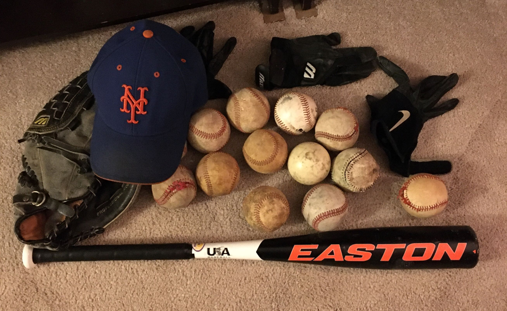

***Maya***: Este mes me divertí practicando béisbol. Me sentí más fuerte que hace varios años. Ahora puedo lanzar la pelota más lejos. Papá y yo trabajamos en fildear, lanzar y batear en el campo. ¡Estoy muy emocionada de jugar béisbol en un equipo por primera vez en abril!

***Carlos***: Este mes ayudé a Maya a prepararse para su primera temporada en las ligas menores. Compramos nuevos pantalones de béisbol, un cinturón, un bate de béisbol y nuevos tacos en Instant Replay Sports aquí en Ithaca. Trabajamos en ejercicios básicos de carrera, fildeo, bateo y lanzamiento. Mostró una mejora en su fildeo, carrera y lanzamiento. Golpear requiere más práctica y repetición, lo cual vendrá con el tiempo. A pesar de la lluvia torrencial y los vientos fríos fuimos a Cass Park, donde se jugarán muchos partidos de la liga. ¡Maya jugará en las ligas menores de Cal Ripken en abril y está muy emocionada! Estoy orgulloso de ella y espero verla crecer como jugadora de béisbol este verano.

