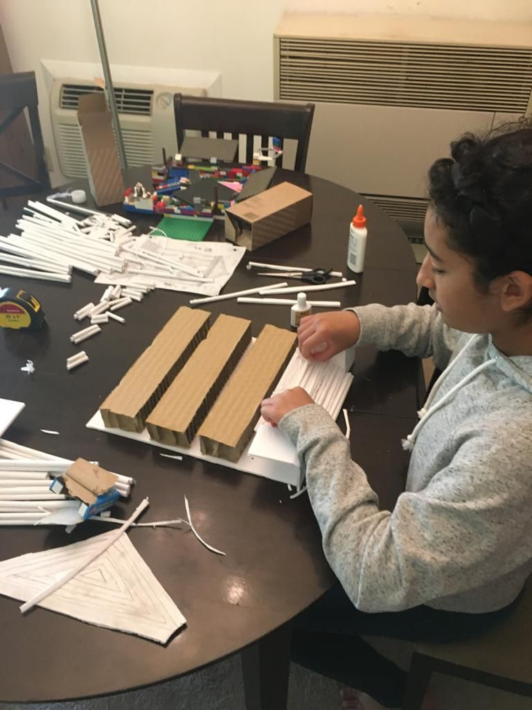
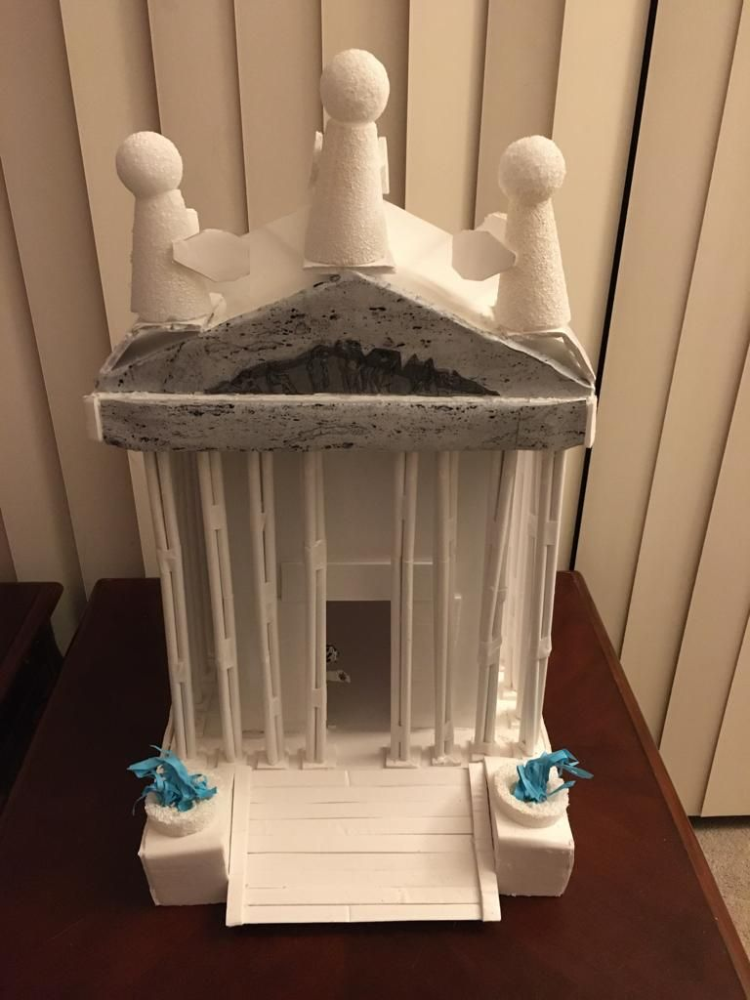
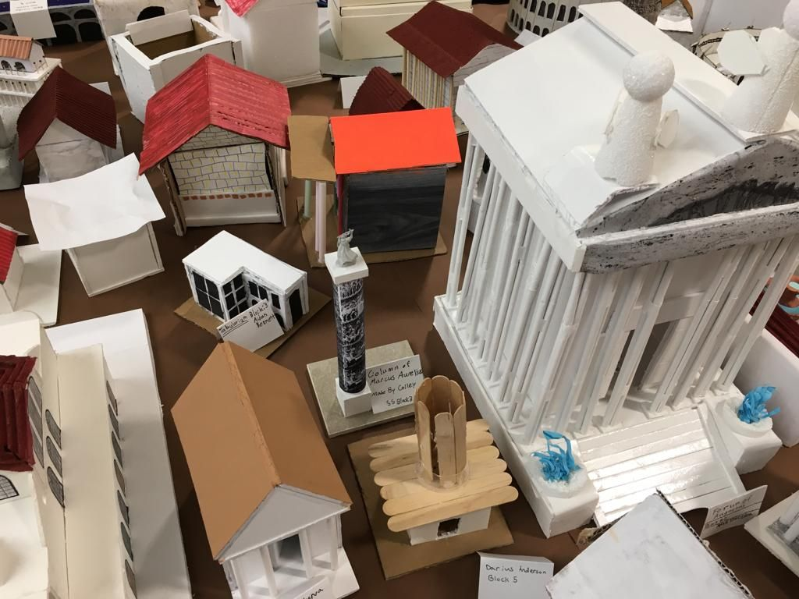
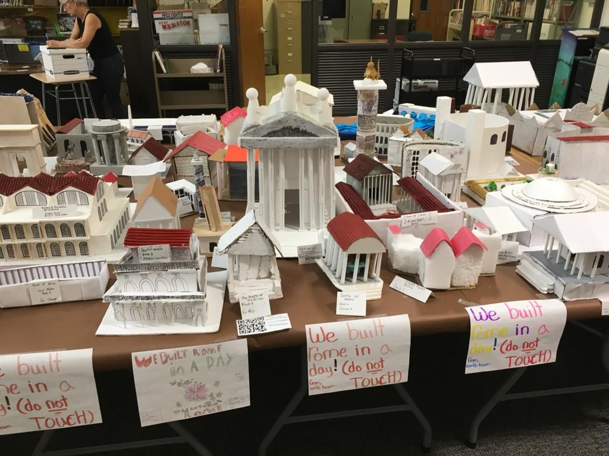

***Maya***: Hice un proyecto para mi clase de Estudios Sociales.

Tuvimos que **Construir Roma en un día**. Hice el Foro de Augusto.

Fui a la casa de una amiga para trabajar en el proyecto y me divertí, pero después tuvimos que arreglar muchas cosas porque lo estropeé. Al final, todo salió bien.

Pasé más de 5 horas construyéndolo con mi papá. Fue divertido, pero también fue frustrante a veces porque perdía una pieza o la ponía en el lugar equivocado, y ambos nos enojamos.

Pero en general, fue una buena experiencia de aprendizaje y una buena manera de aprender a trabajar con otras personas.

***Carlos***: Este mes Maya tenía un proyecto fantástico para construir: una maqueta del Foro de Augusto.

El foro era una parte importante de la antigua ciudad de Roma.

Fue un proceso desafiante y tedioso que incluía muchas piezas móviles, columnas para construir y escaleras para ensamblar hechas de unicel, pegamento, popotes, cartón y cinta adhesiva como materiales principales.

¡Mi trabajo era ayudar a Maya a hacer que el proyecto fuera lo más realista posible y tan único como se pudiera!

A pesar de los desafíos para encontrar la mejor manera de construir esta parte importante de Roma, perseveramos y, como podrán ver en las fotos, ¡resultó increíblemente bien!

Aprendimos una gran lección sobre paciencia, prestar atención a los detalles y cómo trabajar en colaboración.

¡Estoy muy orgulloso de Maya por haber hecho un trabajo increíble con este proyecto!

¡Ayudó a construir Roma en un día!

