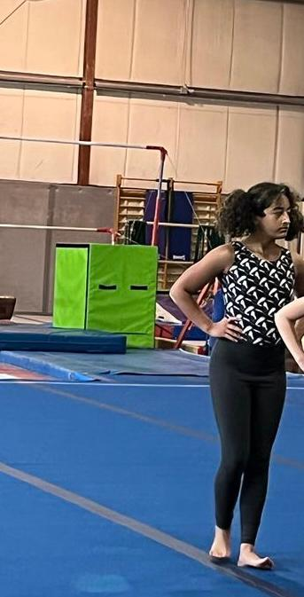
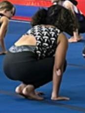
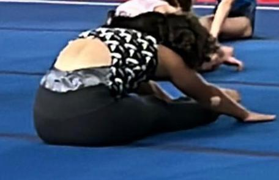
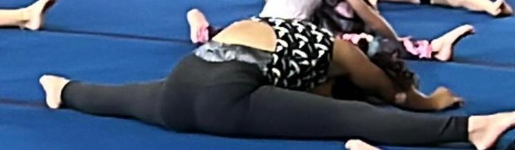
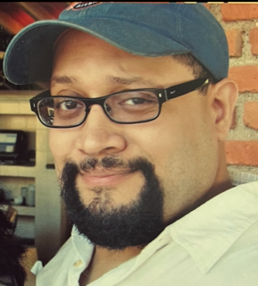
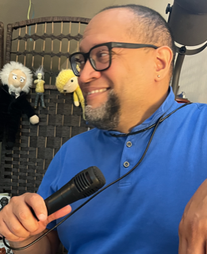
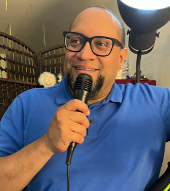
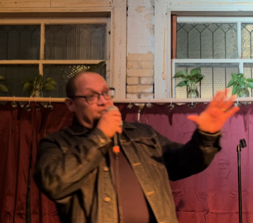

***Maya***: ¡Ya soy parte del equipo de gimnasia!

Yo estaba en la preselección, y tuvimos que aprender diferentes habilidades para llegar al equipo, y lo logré. ¡Estoy en el equipo! Ahora vamos a competir y a aprender diferentes habilidades. Estoy en el nivel 2. En las competencias, es como contra otras personas, pero principalmente contra ti misma.

¡Estoy muy emocionada de estar en el equipo!

***Carlos***: ¡Mi momento del mes pasado es que finalmente hice mi debut en comedia estilo stand-up el 6 de septiembre de 2022! Fue estresante pero divertido. Invité a algunos amigos para que me apoyaran.

He estado esperando hacer esto por más de 35 años aproximadamente.

Le prometí a Maya que haría esto hace unos cuatro años y ahora ya cumplí.

Me preparé para este momento desde enero de este año cuando asistí a varios talleres de escritura de comedia en línea con The Joke Doctor, Jerry Corley, un comediante que lleva mucho tiempo en Hollywood, CA, y que es escritor de comedia nocturna para el Tonight Show, entre otros programas.

En enero comencé oficialmente mi proceso con los talleres de escritura de comedia, participando en grupos de comedia de Facebook y desde entonces he estado escribiendo chistes o ideas todos los días.

Recientemente creé mi presencia en las redes sociales para compartir parte de mi trabajo, ya que planeo volver al escenario en algún momento en los próximos meses.

En el futuro, planeo balancear la vida académica, de investigación y de escritura con mi lado cómico. ¡Planeo convertirme quizás en la primera persona a la que se le pida con éxito que discuta controversias políticas y temas políticos una noche y luego encabece un programa de comedia la noche siguiente!

Ojalá me puedan seguir y compartir mi trabajo. Me llamo Dr. C-Los, Comedian

Pueden echar un vistazo a mi humor social y comedia oscura aquí:

[TikTok](https://www.tiktok.com/@drc_los_comedian?is_from_webapp=1&sender_device=pc)

[YouTube](https://www.youtube.com/channel/UCeIRL3zFrQHJxSWnD3nvitQ/featured)
