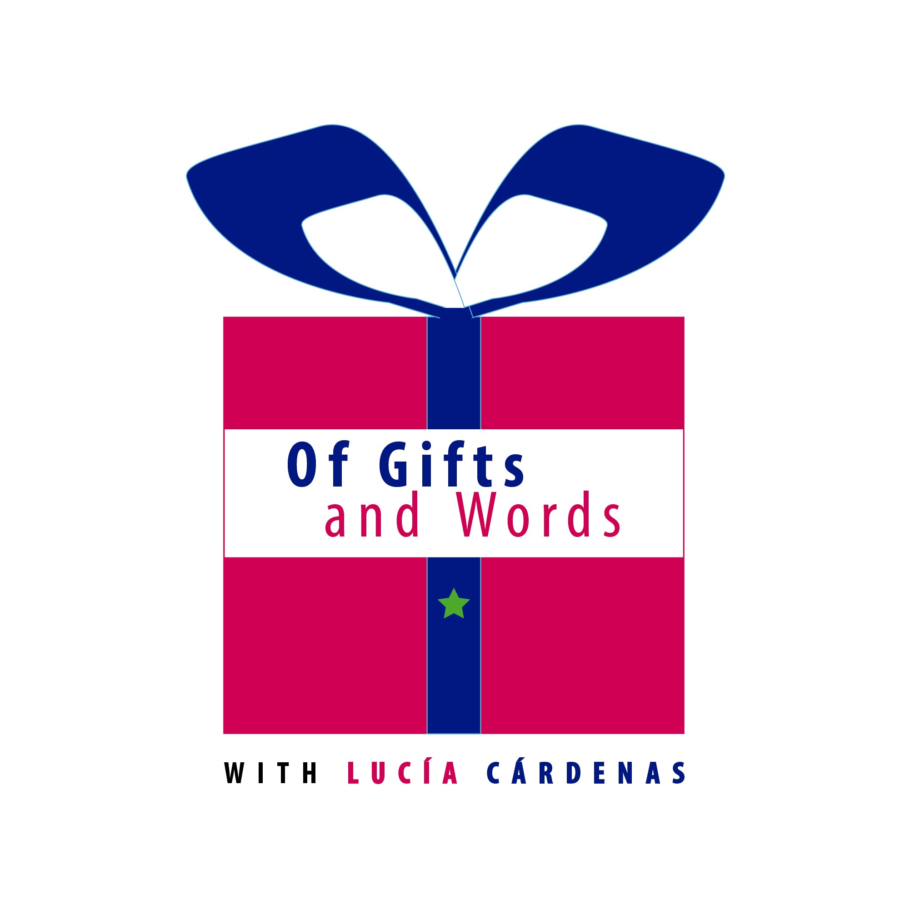
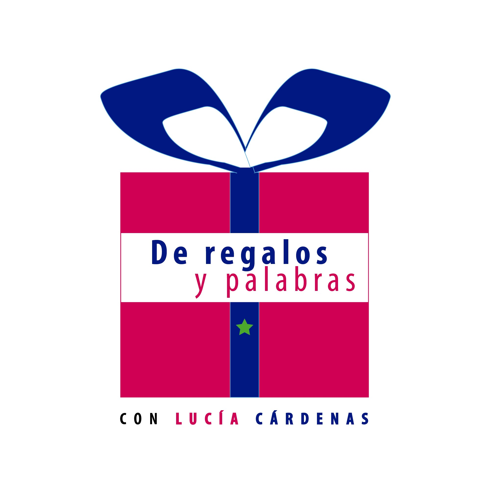

On February 6, 2022, I finally published the introductory episode of my podcast. How exciting!

Given the lovely response from the audience and by popular demand, I have decided to say YES! to record it in English.

I published that episode on February 14, 2022.

You can find the Introductory Episode (in English and Spanish) here:

[Anchor](https://anchor.fm/lucia-cardenas)

[Spotify](https://open.spotify.com/show/7Kqsh8mLHJIlCOIdHXkskT)

[Apple Podcasts](https://podcasts.apple.com/mx/podcast/de-regalos-y-palabras-con-luc%C3%ADa-c%C3%A1rdenas-of-gifts/id1608798314)

[Google Podcasts](https://podcasts.google.com/feed/aHR0cHM6Ly9hbmNob3IuZm0vcy80MWRmNzY3Yy9wb2RjYXN0L3Jzcw/episode/NjBiYmNmYjctY2U3MS00ZDJlLTg4MzctZGM4OGQ1OGZkMzkz?sa=X&ved=0CAUQkfYCahcKEwiYyMnXrab3AhUAAAAAHQAAAAAQAQ)

