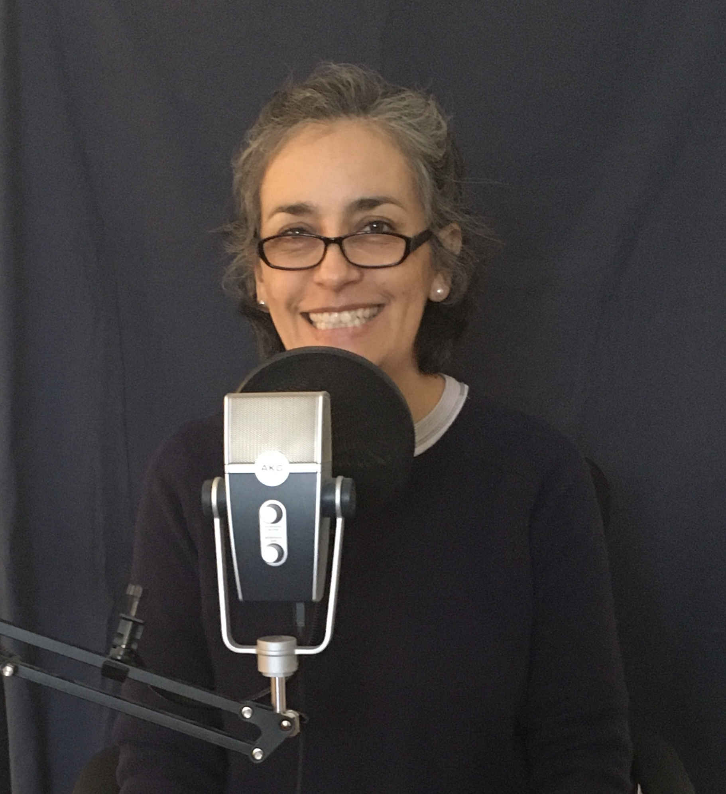

Last year I basically worked on deciding what I wanted to do during my first season. Then my brother Luis (the sound director of my podcast) and I spent several months trying to see where in my apartment I could record to make it sound better… until we discovered that I had the microphone in the wrong position. It's two-sided and I was recording from the wrong side, ha-ha. But hey, that's how you learn.

Keep in mind that he is trying to help me from Mexico while I am here in the United States. So, all the training has been at a distance through WhatsApp or Zoom or whatever we can use.

Once my brother had given me the green light to start recording, it turns out that I wanted to rewrite my first episode because I became a super fan of [The Moth](https://themoth.org/podcast) podcast and since I love how people tell their stories, I wanted to tell mine just like they do.

I looked for the methodology they use and am working on it. I have been writing and rewriting and won’t stop until I have something that I like a lot. When I get to that point, I will record my first episode.

I'll keep you posted ... but I am getting there.
