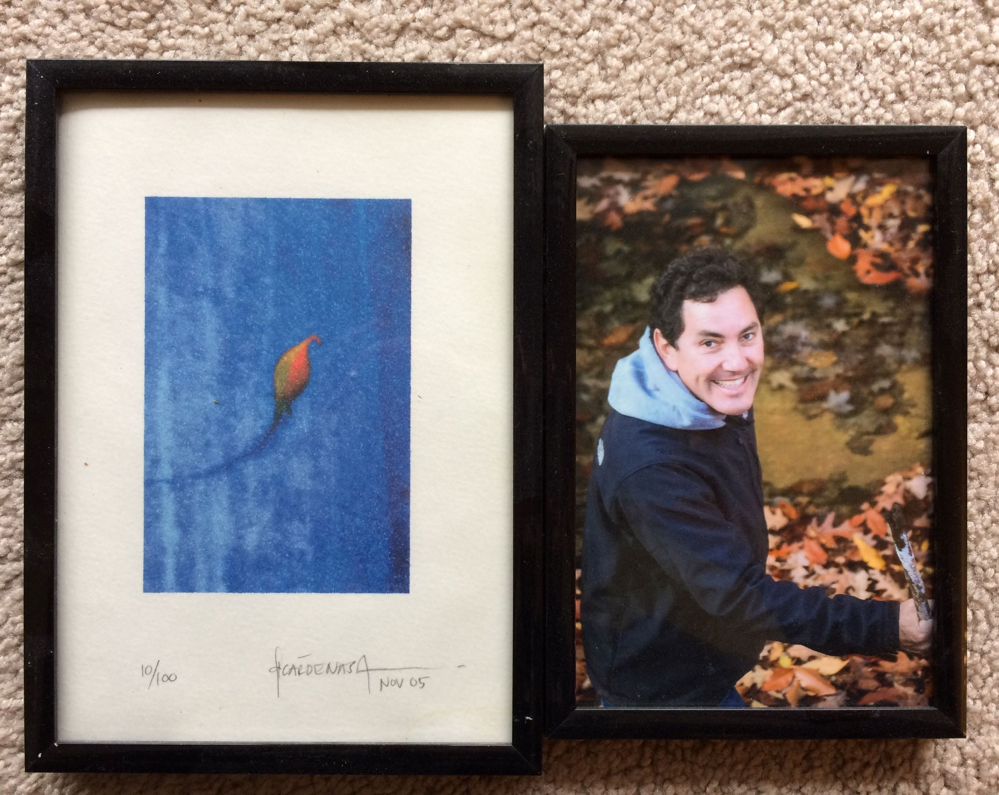

On March 13, 2022 I published **Episode #1: Words that Inspire.**

I tell you about the text that has inspired me to do many creative things and live life to the fullest. The text was written by my brother Héctor titled “What if I Say Yes?”

[Anchor](https://anchor.fm/lucia-cardenas/episodes/Episode-1---Words-That-Inspire-e1flutg)

[Spotify](https://open.spotify.com/episode/4phiV26RUddOVBsybHxWdj?si=NBrIp7NGSaSei3zenwgVNQ)

[Apple Podcasts](https://podcasts.apple.com/mx/podcast/episode-1-words-that-inspire/id1608798314?i=1000553894014)

[Google Podcasts](https://podcasts.google.com/feed/aHR0cHM6Ly9hbmNob3IuZm0vcy80MWRmNzY3Yy9wb2RjYXN0L3Jzcw/episode/NDIwZjM3YjAtYTZkMS00ODgwLWExZWMtMWJlNWJiMzJiYzM1?sa=X&ved=0CAUQkfYCahcKEwi47J-Ozbn3AhUAAAAAHQAAAAAQCg)
