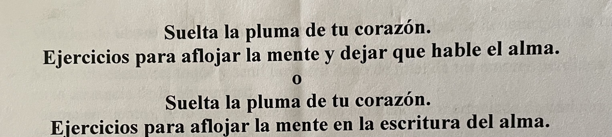

One more month that goes by and I can't finish my episode 5, about the words that are playful...

Writing something interesting around the words that my twin and I wrote many years ago has turned out to be more complicated than I expected.

But I'm not giving up.

This month, November, I am going to finish the text, record the episode and publish it.

I promise!

Until then, here is a preview:

“*Synchronies of the renewing spirit, on the path of a meaningless dream, waiting for the mountains of a dawn*” **– Jorge**

“*I just met the spiders of my anguish in love with my being*” **– Lucía**
