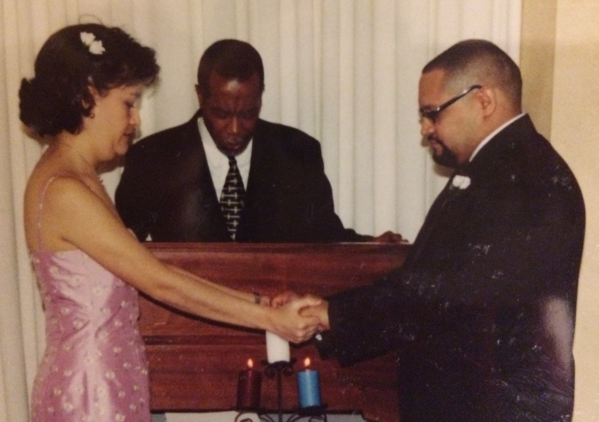
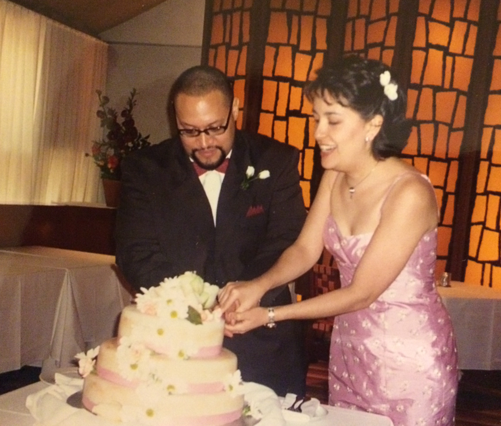
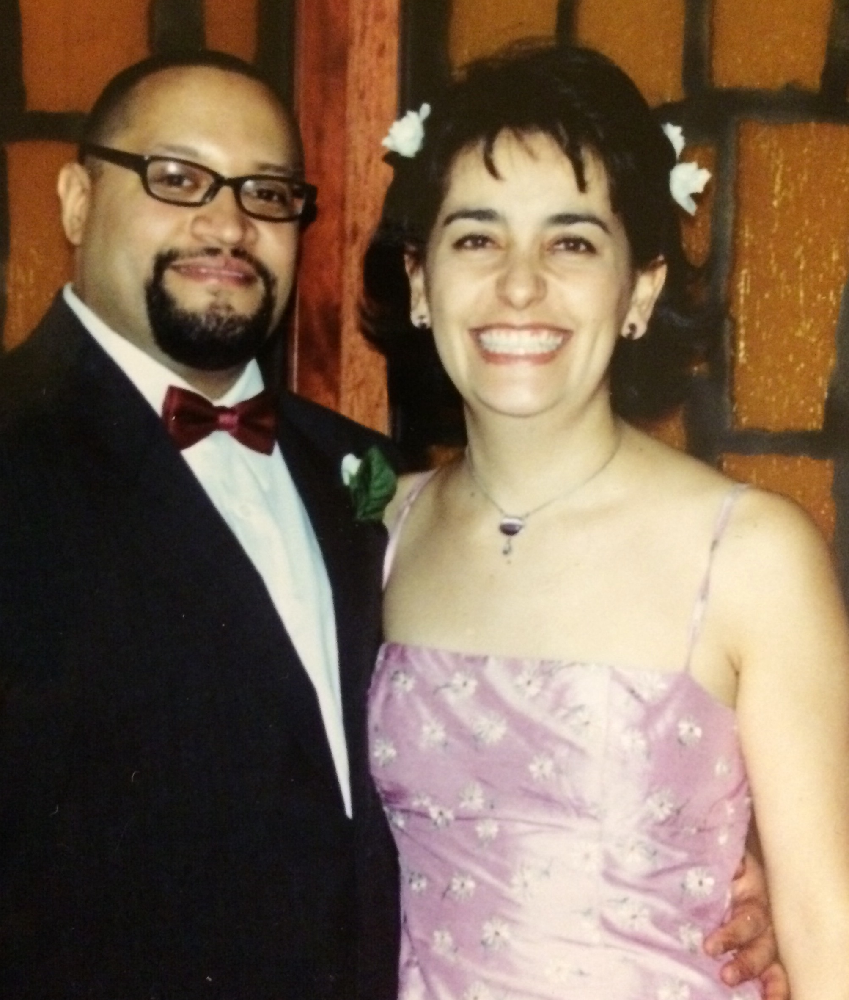

El 12 de abril del 2022 publiqué el **Episodio #2: Palabras que prometen.**

Les hablo de mi relación con Carlos y de cómo se fue desarrollando hasta llegar a la propuesta de matrimonio y la planeación de la boda. Todo esto con la idea de darles un poco de contexto antes de leerles lo que le escribí a mi Carlos como mis votos de matrimonio.

[Anchor](https://anchor.fm/lucia-cardenas/episodes/Episodio-2---Palabras-que-prometen-e1h3qg7)

[Spotify](https://open.spotify.com/episode/6Ag9C9FouiQh4zHR5diRTg?si=O4kheKMxSCWrOTO-slq-AQ)

[Apple Podcasts](https://podcasts.apple.com/mx/podcast/episodio-2-palabras-que-prometen/id1608798314?i=1000557413115)

[Google Podcasts](https://podcasts.google.com/feed/aHR0cHM6Ly9hbmNob3IuZm0vcy80MWRmNzY3Yy9wb2RjYXN0L3Jzcw/episode/YWNmYzkzOTQtOTgyOC00M2U0LWE0NzYtOTcxMWE5ZDFjMjMy?sa=X&ved=0CAUQkfYCahcKEwi47J-Ozbn3AhUAAAAAHQAAAAAQCg)

