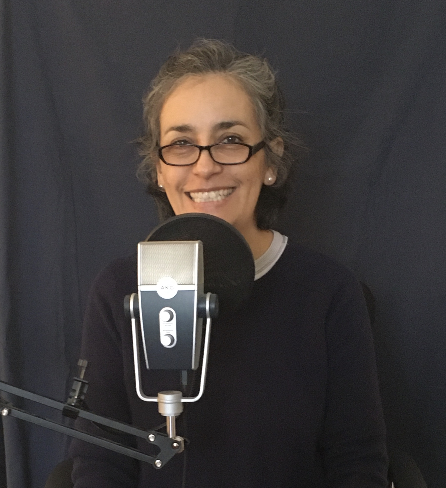

El año pasado básicamente lo dediqué a decidir qué quiero grabar en mi primera temporada. Luego, mi hermano Luis (el director de sonido de mi pódcast) y yo nos tardamos varios meses tratando de ver dónde en mi departamento podía grabar para que se oyera mejor… hasta que descubrimos que tenía el micrófono al revés. Es de dos caras y yo grababa desde la cara incorrecta, jaja. Pero bueno, así se aprende.

Tomen en cuenta que él está tratando de ayudarme desde México mientras yo estoy aquí en los Estados Unidos. Entonces, todo el entrenamiento ha sido a la distancia a través de WhatsApp o Zoom o lo que se pueda.

Una vez que ya mi hermano me había dado luz verde para grabar, resulta que quise reescribir mi primer episodio porque me hice super fanática del pódcast [The Moth](https://themoth.org/podcast) y como me encanta cómo cuenta la gente sus historias, yo quiero contar la mía así.

Busqué la metodología que usan y en esas ando. Escribiendo y reescribiendo hasta que me quede algo que me guste mucho. Cuando llegue a ese momento, grabaré mi primer episodio.

Los mantendré al tanto… pero ya falta menos.
