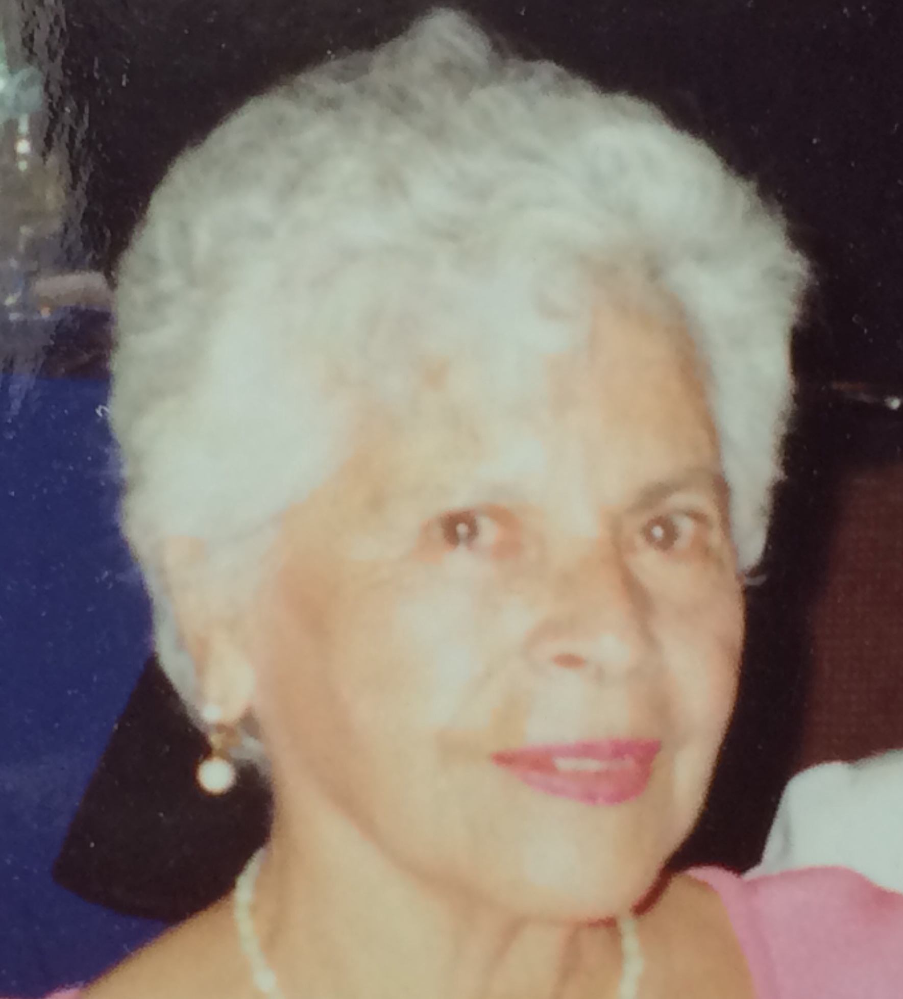

Cuando me senté a escribir el Episodio 4, sobre las palabras catárticas, me di cuenta de que había muchas cosas que necesitaba investigar de la vida de mi abuela materna, Mami.

Creo que voy a hacer lo mismo que hice con el episodio anterior: me voy a tomar mi tiempo para que lo que termine publicando refleje de la manera más honesta quién era mi abuela adorada.

Pueden escuchar el episodio más reciente aquí:

[Anchor](https://anchor.fm/lucia-cardenas/episodes/Episodio-3---Palabras-que-acompaan-e1jhj1q)

[Spotify](https://open.spotify.com/episode/6Gs35CnIdvsXi8NhmGfnVB)

[Apple Podcasts](https://podcasts.apple.com/mx/podcast/episodio-3-palabras-que-acompa%C3%B1an/id1608798314?i=1000565283206)

[Google Podcasts](https://podcasts.google.com/feed/aHR0cHM6Ly9hbmNob3IuZm0vcy80MWRmNzY3Yy9wb2RjYXN0L3Jzcw?sa=X&ved=0CAMQ4aUDahcKEwio6vKDl5r4AhUAAAAAHQAAAAAQAQ)
