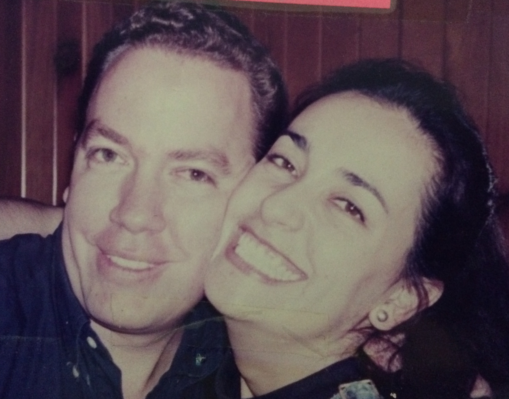

Por fin terminé de escribir este episodio tan especial sobre mi gemelo fraterno, Jorge.
Se lo mandé antes de grabarlo para obtener su aprobación (no estaba dispuesta a publicar nada que lo hiciera sentirse incómodo o que él no quisiera que yo contara). Una vez que lo aprobó, lo grabé y se lo mandé a mi hermano Luis para que lo produjera.
Lo publicamos el 5 de junio.
Ojalá les guste.

Pueden encontrar el episodio en español aquí:

[Anchor](https://anchor.fm/lucia-cardenas/episodes/Episodio-3---Palabras-que-acompaan-e1jhj1q)

[Spotify](https://open.spotify.com/episode/6Gs35CnIdvsXi8NhmGfnVB)

[Apple Podcasts](https://podcasts.apple.com/mx/podcast/episodio-3-palabras-que-acompa%C3%B1an/id1608798314?i=1000565283206)

[Google Podcasts](https://podcasts.google.com/feed/aHR0cHM6Ly9hbmNob3IuZm0vcy80MWRmNzY3Yy9wb2RjYXN0L3Jzcw?sa=X&ved=0CAMQ4aUDahcKEwio6vKDl5r4AhUAAAAAHQAAAAAQAQ)

