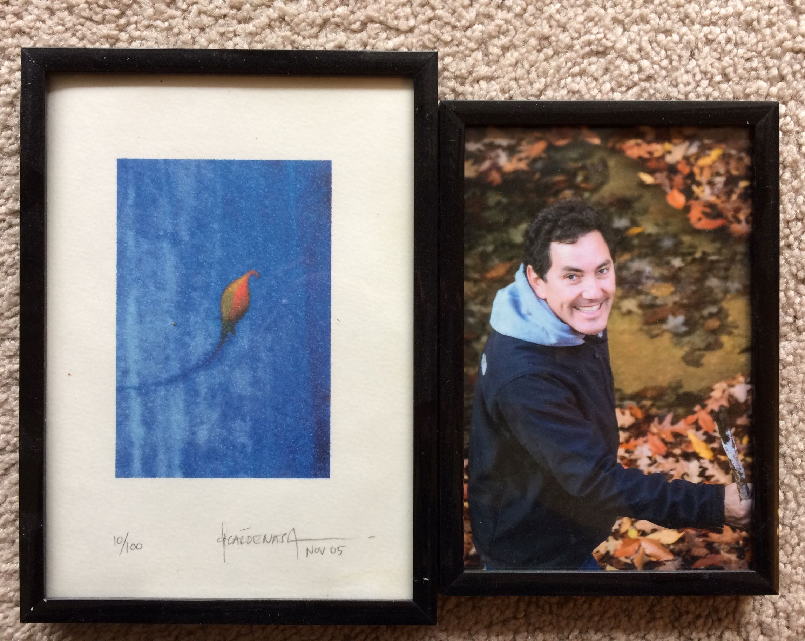

El 6 de marzo del 2022 publiqué el **Episodio #1: Palabras que inspiran.**

Les hablo del texto que me ha inspirado a hacer muchas cosas creativas y vivir la vida a plenitud. Ese texto lo escribió mi hermano Héctor y se titula “¿Y si digo que sí?”

[Anchor](https://anchor.fm/lucia-cardenas/episodes/Episodio-1---Palabras-que-inspiran-e1f8rlj)

[Spotify](https://open.spotify.com/episode/5tyyw9Mi6H6vMZMkd75zGr?si=xrxoiFe7QDORbvW-dki81Q)

[Apple Podcasts](https://podcasts.apple.com/mx/podcast/episodio-1-palabras-que-inspiran/id1608798314?i=1000553069766)

[Google Podcasts](https://podcasts.google.com/feed/aHR0cHM6Ly9hbmNob3IuZm0vcy80MWRmNzY3Yy9wb2RjYXN0L3Jzcw/episode/OWQzOTg3NWItMmFhOC00YzgwLWFjZWEtN2I1OGVmMGM1NzJk?sa=X&ved=0CAUQkfYCahcKEwi47J-Ozbn3AhUAAAAAHQAAAAAQCg)
