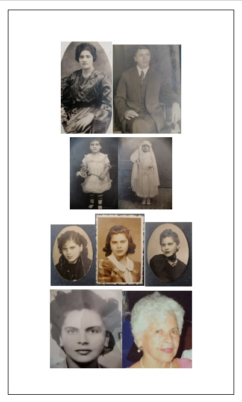

¡Finalmente lo hice! Publiqué el Episodio #4: Palabras que son catárticas.

Se trata de mi abuela materna, Mami.

Si quieren descubrir a la maravillosa mujer que fue mi abuela, escuchen el episodio donde quiera que escuchan sus podcasts.

¡Que lo disfruten!

[Anchor](https://anchor.fm/lucia-cardenas/episodes/Episodio-4---Palabras-que-son-catrticas-e1o0945)

[Spotify](https://open.spotify.com/episode/577DRurj5o7OP3EuUDhoZG)

[Apple Podcasts](https://podcasts.apple.com/mx/podcast/episodio-4-palabras-que-son-cat%C3%A1rticas/id1608798314?i=1000579800291)

[Google Podcasts](https://podcasts.google.com/feed/aHR0cHM6Ly9hbmNob3IuZm0vcy80MWRmNzY3Yy9wb2RjYXN0L3Jzcw/episode/ZGI5NTc1NjEtZTdjNi00ZTY0LThjNTktM2M1ZWJhMzJjOWYw?sa=X&ved=0CAUQkfYCahcKEwjo46_t0736AhUAAAAAHQAAAAAQAQ)
