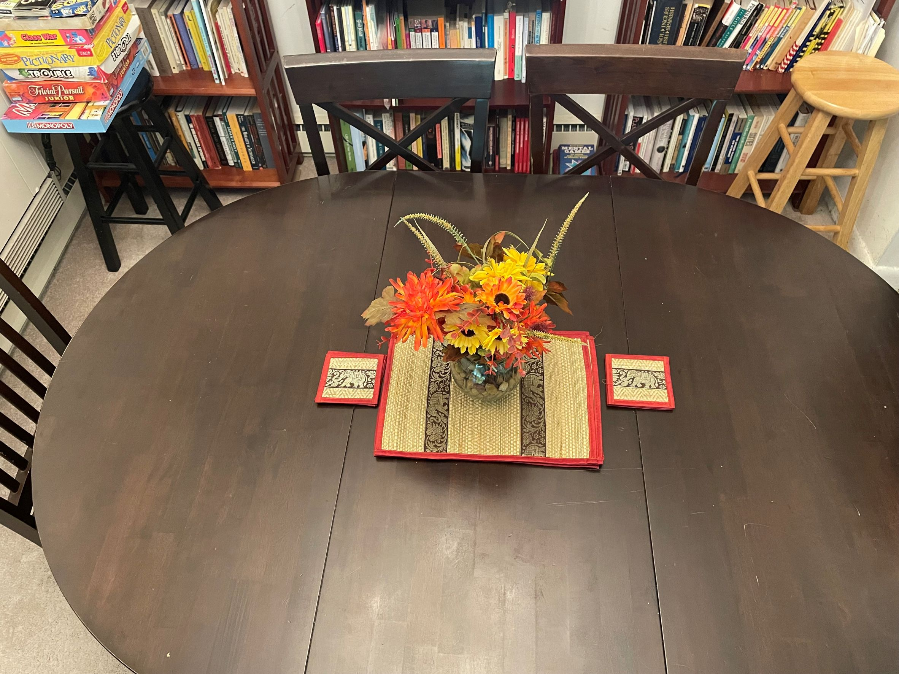

**How much effort should be put into keeping a home tidy, especially when the inhabitants of said space have different notions of what order means, ha-ha?**

— *I would say that I am not the best person to give advice on this, since I have not managed to impose my own sense of order in my home, ha-ha.*

*But if you ask me what I think about the subject, I think it is difficult for all the inhabitants of a space to have the same sense of order and it is not easy to impose a single sense of order either.  So, it seems to me, that the person interested in maintaining the tidy home always ends up putting more effort than others, even if it is not fair.*

*Now, that person can change their perspective on what they are doing and instead of taking it as something negative (doing what others should have done) take it as contributing to the common good, because in the end, a tidy home is a beautiful place to live in!*

