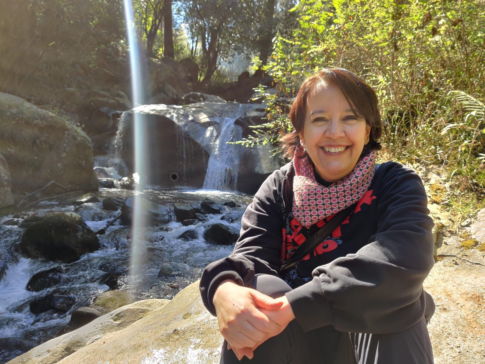

Hello dear sister,

The moment of truth has arrived. I am going to ask you a question for the blog and you're going to give me some advice, ready?

**What is the best way to start the new year?**

*Hahaha, I already got stage fright. But here I go:*

*I would say that the best way to start the year is to write down what you want to achieve and have it in sight as much as possible. It also helps to put on the wallpaper of the cell phone that you see all the time, some image that motivates you to do what you want to achieve. For example, Luis [our older brother] put the image of* [Nims Purja](https://www.nimsdai.com/) *(the one who climbed the 14 peaks of more than 8 thousand meters). I went for something different and put* [Saitama](https://characterprofile.fandom.com/wiki/Saitama) *(the one from the anime ["One Punch Man"](https://www.imdb.com/title/tt4508902/)) who decides to train non-stop for 3 years to become stronger. In the end, they are examples of willpower worthy of being copied. And I also like to think that you can start the year with optimism and try to find the positive side of things. Just like  [Mike Wasowski](https://www.bing.com/images/search?view=detailV2&ccid=HKNNuGjd&id=704A998EC2F53B5F363A90AFBF45FF4977300E54&thid=OIP.HKNNuGjdNNaWOKe_jyZ1tAHaI_&mediaurl=https%3a%2f%2fwww.khwiki.com%2fimages%2f9%2f90%2fMike_Wazowski_KHIII.png&cdnurl=https%3a%2f%2fth.bing.com%2fth%2fid%2fR.1ca34db868dd34d69638a7bf8f2675b4%3frik%3dVA4wd0n%252fRb%252bvkA%26pid%3dImgRaw%26r%3d0&exph=1012&expw=834&q=Mike+Wasowski&simid=607993268512584795&FORM=IRPRST&ck=836ACC604194ADDAB9EC74BA4639BF91&selectedIndex=0&ajaxhist=0&ajaxserp=0) in Monsters, when he said "I'm on the cover of a magazine !!!" and only his feet were visible, ha-ha. In short: start the year with goals and a good attitude.*
