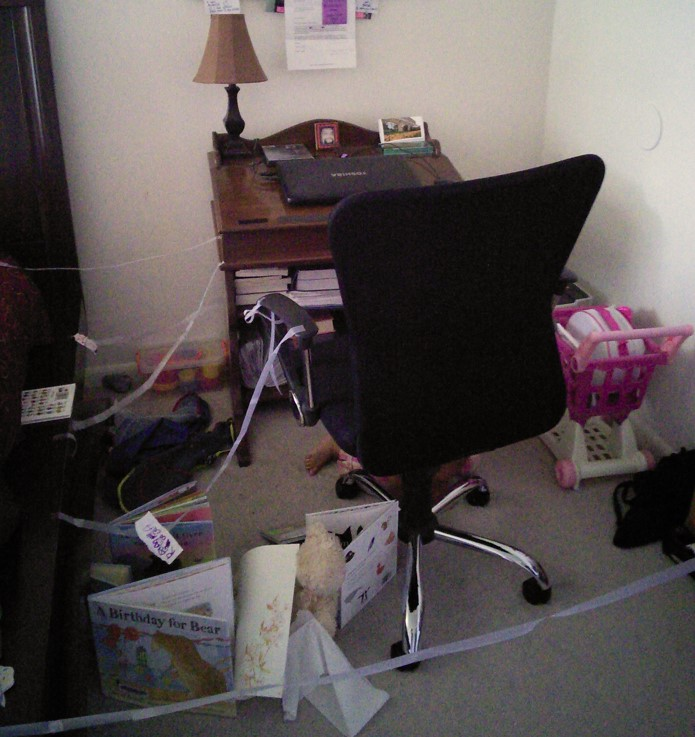

— A question for your sister (the same one I have for all mothers): **"How to harmoniously combine personal and work projects with motherhood :) ?”**

— *I believe that everyone can find the best possible solution according to their own circumstances.*

*I mean, it is easier to have time for your personal or work projects if you have other people who can support you with the care of your children, like your partner or relatives, or if you can leave them in evening activities or daycare, or if you have understanding bosses who get your new role as a mom.*

*I believe that dedicating time to your personal or work projects does not necessarily imply a lack of attention to your children, but you do have to be on the lookout to adjust in case it affects them, because each child is different.*

*And always have a space to spend quality time with them and make them feel how important they are in your life.*
