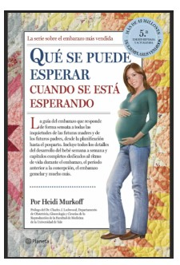
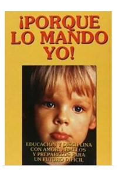
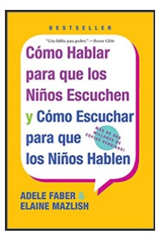

**Dear sister, this month's question is:**

**What books have you read, from your first pregnancy until now, that you think have helped you be a better mom?**

— *The books that I remember today that helped me at least understand what I was going through (I can't be sure that they made me a better mom, ha ha) are these:*

• **What to Expect When You’re Expecting**

• **Your Baby and Child** and **Because I Said So!**

• **How To Talk So Kids Will Listen and Listen So Kids Will Talk** - version for children and adolescents.

*I remember reading more books at the time, but my memory is not very good. I suppose that if I remember the ones I mentioned, it is because they are the ones that impacted me the most.*
