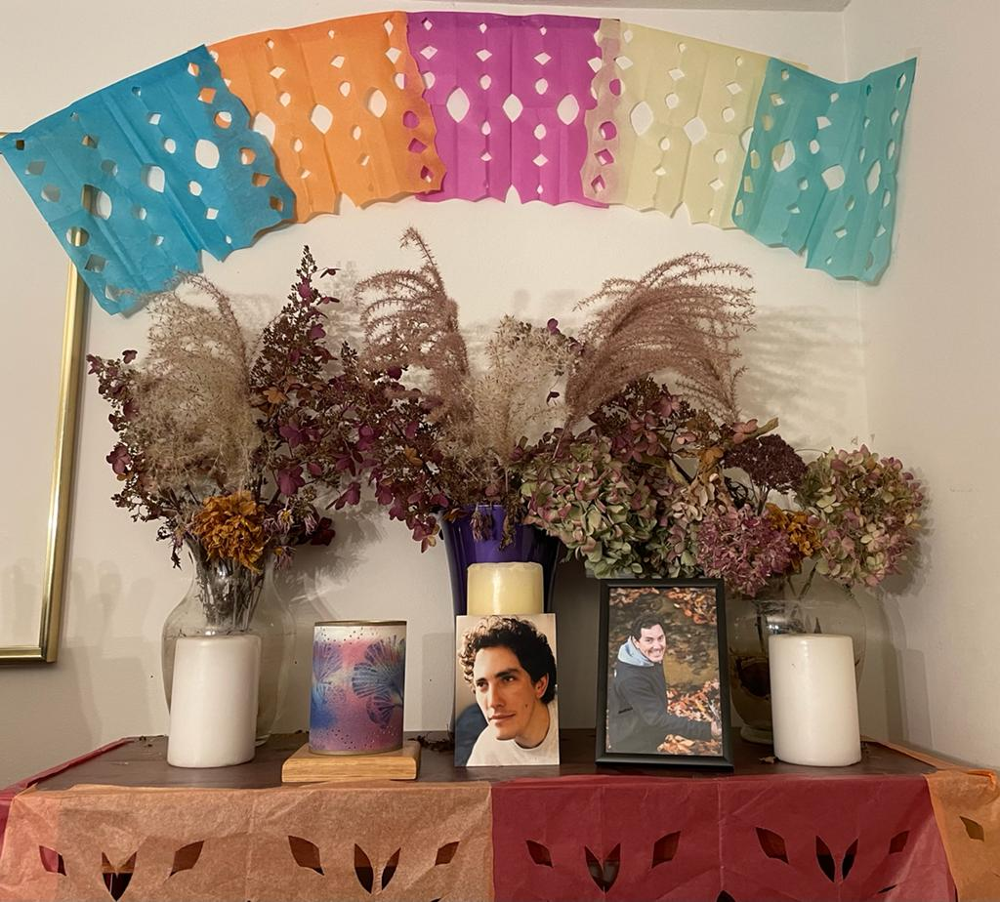

**How to prepare sons and daughters regarding the subject of the death of loved ones?**

— *Oh, the things you ask me, ha-ha! Here I go:*

*I remember reading in some book that it was important that, if a loved one had died, the adults explained to the children that this was part of the cycle of life, that all living beings are born, grow up and die.*

*It was also important to explain to them what had happened, so that they would understand why the adults were crying, sad or downcast.*

*I was very struck by the fact that they recommended that this be done regardless of the child's age, even if he or she was a baby.*

*They said that children are very perceptive, and that it was always better to talk to them.*

*As for the fear of dying, I think it is something that not even many adults can avoid.*

*I remember telling my son, Berni, that no one knows what happens next… That some people think we either go to heaven or hell; there are some who think that we reincarnate; those who think that we turn into star dust; those who think that there is nothing else after this life, and so on.*

*And so, if in the end nobody knows what happens after we die, then we (he and I) could choose what we wanted to happen next and visualize it. I also told him that I had read in some other book, that in some research they had seen that when a person had a near-death experience, they remembered having contact with someone close and dear to them who had died before… And that was also a little comforting: To think that wherever you go, your loved ones (who left before you) will be waiting for you….*
