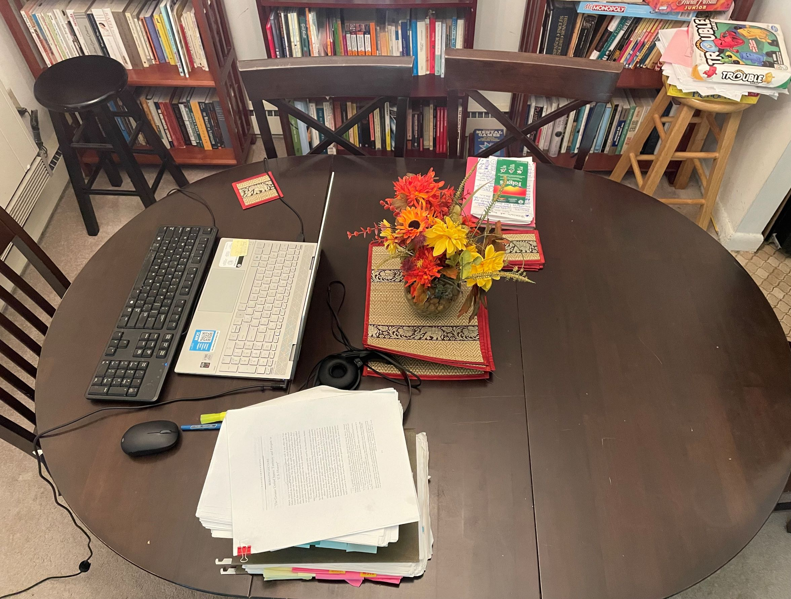
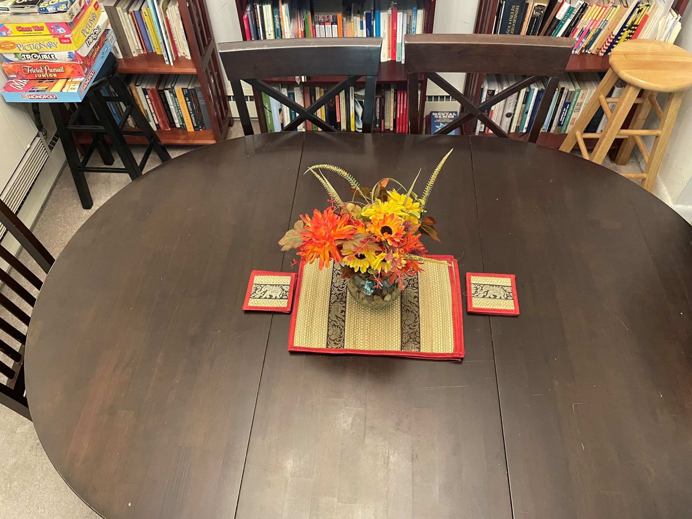

**¿Cuánto esfuerzo hay que ponerle a mantener un hogar ordenado, sobre todo cuando los habitantes de dicho espacio tienen distintas nociones de lo que significa el orden, jaja?**

— *Para esta pregunta, te diría que yo no soy la más indicada para dar consejos al respecto, ya que no he logrado imponer mi propio sentido de orden en mi hogar jajaja.*

*Pero si me preguntas qué opino sobre el tema, creo que es complicado que todos los habitantes de un espacio tengan el mismo sentido de orden y tampoco es fácil imponer un sentido de orden único, por lo que me parece que la persona interesada en mantener el hogar ordenado acaba poniendo siempre más esfuerzo que los demás, aunque no sea algo justo.*

*Ahora, esa persona puede cambiar su perspectiva sobre lo que está haciendo y en vez de tomarlo como algo negativo (estar haciendo lo que otros debieron hacer) tomarlo como que está contribuyendo al bienestar común, porque al final, ¡un hogar ordenado es un lindo lugar para vivir!*

