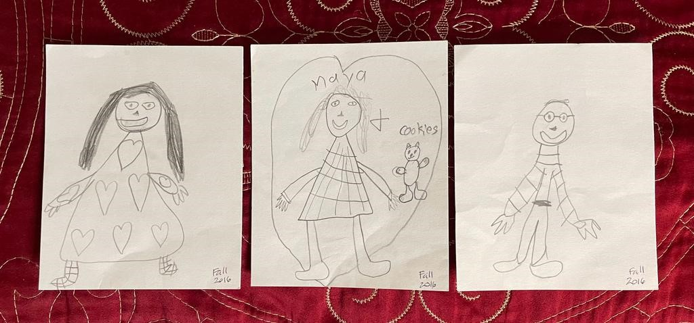

**¿Cómo decidir dónde pasar las vacaciones de Navidad o de fin de año, cuando los miembros de la familia quieren todos cosas distintas?**

Creo que, en cualquier caso, lo que sugeriría es negociar. A mí me parece importante la unión familiar, así es que trataría de negociar para darle gusto a todos, pero estando todos juntos (darles gusto a unos en una fecha, a otros en la otra fecha).

Sin embargo, sé que eso no es siempre posible y al final de cuentas se trata de que todos estén contentos, así es que, si no se logra que estén todos juntos, dejaría que cada quien hiciera lo que lo haga feliz… A final de cuentas, son solo dos días del año.

Claro que esto depende de la edad de los chamacos, porque mientras están chicos, se tendrán que ajustar a las decisiones de los papás.

Lo siento, pero no hay recetas para resolver todas las problemáticas que resultan de las dinámicas familiares, ja, ja.
