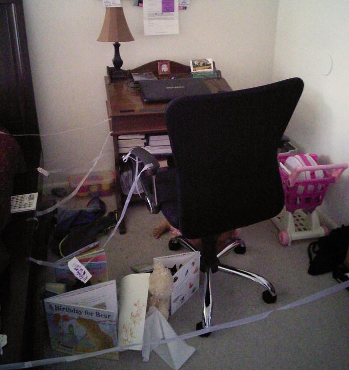

— Una pregunta para tu hermana (es la que tengo para todas las mamás): **"¿cómo combinar de manera armónica los proyectos personales y laborales con la maternidad :)?”**

— *Creo que cada quien puede encontrar la mejor solución posible de acuerdo a sus propias circunstancias.*

*Me refiero a que es más fácil poder tener tiempo para tus proyectos personales o laborales si tienes a otras personas que pueden apoyarte con el cuidado de tus hijos, como tu pareja o familiares, o si puedes dejarlos en actividades vespertinas o guarderías, o si tienes jefes comprensivos que entienden tu nuevo rol de mamá.*

*Pero si no tuvieras ninguna de estas ventajas, dado que la etapa más complicada es cuando los hijos son pequeños, diría que la opción es postergar un poco el proyecto personal o laboral en lo que los hijos son un poco más grandes.*

*Creo que dedicar tiempo a tus proyectos personales o laborales no implica necesariamente falta de atención para tus hijos, pero sí hay que estar al pendiente para hacer ajustes en caso de que les llegara a afectar, porque cada hijo es diferente.*

*Y siempre tener un espacio para dedicarles tiempo de calidad y hacerles sentir lo importantes que son en tu vida.*
