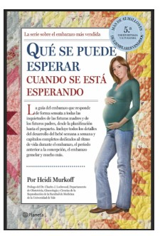
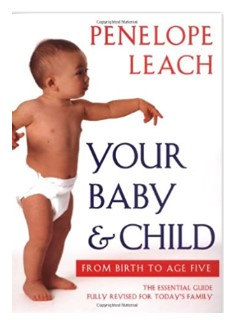
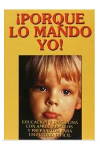
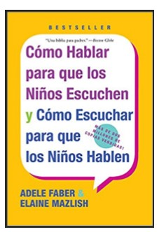

**Hermanita, la pregunta de este mes es:**

**¿Qué libros has leído, desde tu primer embarazo hasta ahora, que creas que te hayan ayudado a ser mejor mamá?**

— *Los libros que hoy recuerdo que me ayudaron al menos a entender por lo que estaba yo pasando (no puedo asegurar que me hayan hecho mejor mamá ja, ja) son éstos:*

• **Qué se puede esperar cuando se está esperando** - para el embarazo

• **Your Baby and Child** y **¡Porque lo mando yo!**

• **Cómo hablar para que los niños escuchen y cómo escuchar para que los niños hablen** - versión para niños y para adolescentes.

*Recuerdo haber leído más libros en su momento, pero mi memoria no es muy buena. Supongo que si recuerdo los que mencioné es porque son los que más me impactaron.*
