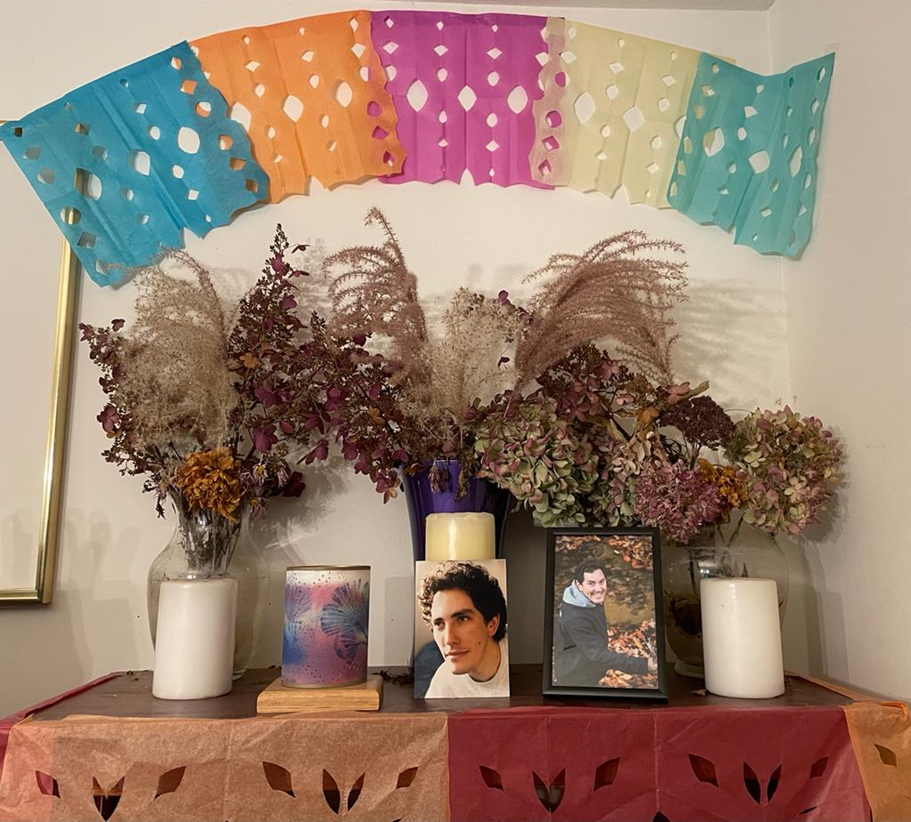

**¿Cómo preparar a los hijos e hijas con respecto al tema de la muerte de seres queridos?**

*Ay mi Luci, me preguntas cada cosa …. Jajaja. Pero bueno, ahí te va:*

*Recuerdo que en algún libro leí que era importante que, si había muerto algún ser querido, se les explicara a los niños/as que esto era parte del ciclo de la vida, que todos los seres vivos nacen, crecen y mueren.*

*Que también era importante explicarles qué había pasado, para que entendieran por qué los adultos lloraban, estaban tristes o cabizbajos.*

*Me llamó mucho la atención que recomendaban que esto se hiciera independientemente de la edad del niño/a, aunque fuera bebé.*

*Decían que los niños/as perciben muchas cosas y que era mejor hablar con ellos siempre.*

*En cuanto al miedo a morir, que yo creo que es algo que ni siquiera muchos adultos podemos evitar.*

*Me acuerdo haberle dicho a Berni que nadie sabe lo que pasa después, que hay quien piensa que te vas al cielo o al infierno, los que piensan que reencarnas, los que piensan que te vuelves polvo de estrella, los que piensan que ya no hay nada más después y así, y que si al final nadie sabe bien, que por qué no elegíamos qué queríamos que pasara después y nos imagináramos que eso es lo que sucede.*

*Y que también había leído en algún otro libro, que en alguna investigación habían visto que cuando una persona tenía una experiencia cercana a la muerte, recordaba haber tenido contacto con alguien cercano y querido que había muerto antes.*

*Así es que eso también reconforta un poco: pensar que a donde sea que vayas, te estarán esperando tus seres queridos que se fueron antes que tú….*
