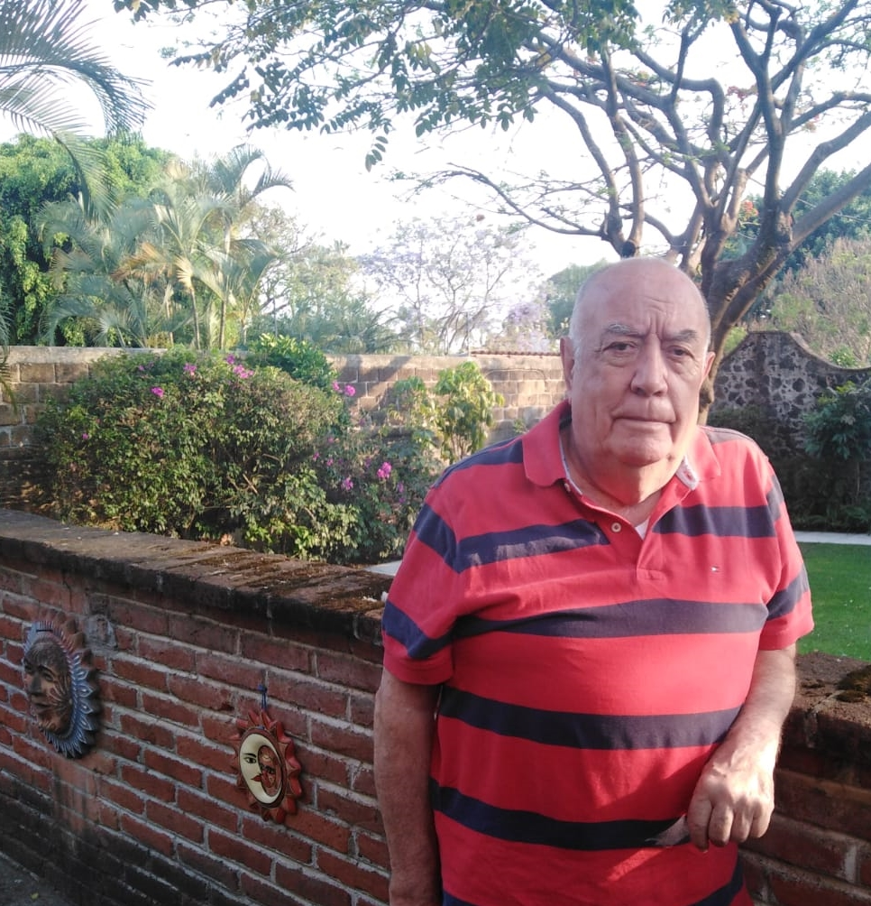
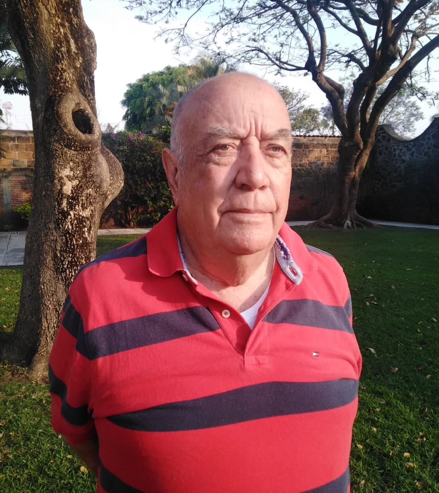

Now it's my daddy's turn, Luis Cárdenas Cuenca. This month I nominated him to be The What if I say yes? Person of the Month, first, because this month is his birthday; and second, because I want to celebrate how lucky I am to have him in my life.

The people who know him (family, friends, etc.) have learned a lot from him. It is for me the clearest example of a life well-lived.

Here are my 10 questions, so you can get to know him better:

***1. How would you describe yourself?***

As a very lucky person, who has had opportunities in all areas of his life.

Let's see… I am, responsible, loyal, honest.

My wife would say I have on occasion, a short fuse.

I like reading and playing card games on the computer.

I like chess.

I really enjoyed golf.

I like playing dominoes.

I always tried to be a good husband and a good father.

Having gone to a university allowed me to learn how to learn.

I really enjoyed traveling the world working and sightseeing.

I was worried about not being economically independent when I got older.

***2. What do you want out of life?***

At this point in my life, I want to see my children, sons-in-law, daughter-in-law, and grandchildren happy with their lives. I hope they know that not everything is a bed of roses, but such is life.

***3. Why do you do the things you do?***

At this point in my life I do things because I want to do them.

***4. How do you understand the “What If I Say Yes” process***?

These days it feels like a challenge, but I am not at the level of my children who are more open to experimenting, exploring, or innovating.

***5. What would you say was your earliest “What If I Say Yes” moment?***

Although it was not the first, I will tell you about one moment that I consider very important because it is another turning point in my life.

I remember when a co-worker at IBM (Ulysses Pego Moscoso) called me into his office to ask me for advice. He didn't know what to do regarding an offer the company was possibly going to make. It had to do with a very juicy voluntary retirement for employees who had more than 20 years working there.

We sat down to think about possible scenarios and ended with his decision to say yes if it were offered to him.

Two weeks later he calls me and tells me “I have good news for you”. I thought it was about his decision, but it wasn't that. It was that the company was going to reduce the range of years worked to 15 (and not 20 as we had thought). With this change, I could also take the early retirement offer.

That day driving from Mexico City to Cuernavaca, which is where we lived, I couldn't deal with all the brainstorming in my head. When I got home, after dinner and putting the children to bed, my wife and I sat down to talk and I think that was the beginning of the process of What would happen if we said yes?

It meant giving up job security, health insurance, etc. and becoming an Independent Consultant. So, we went for the security of the insecurity (as a very dear friend -Ignacio Ocampo- called it) and decided to accept the plan if it were offered to me. Which did happen.

***6. Describe your most recent “What If I Say Yes” moment.***

This situation where my daughter Lucía interviews me.

Normally I would have said “no” because I don't feel comfortable talking about myself.

***7. What things have you created in your life after having said “What If I Say Yes”? Make a list.***

In 1953, we founded the **newspaper** for the streets of Violeta and Guerrero. I was the editor and cartoonist. It only lasted a few editions, but we enjoyed reading our newspaper in the afternoons.

In 1957, a dear friend and I created **Heinen and Cárdenas, Private Investigators**. It didn't work due to lack of customers, haha.

In 1967, Sergio Martínez, Raúl Velasco, Jorge (my brother) and I came together to start a construction company with offices in Balderas, Mexico City. We called it **MARVECA, S.A.**

In 1983, I started a consulting company called **Sinergia, S.A.** with the first boss I had at the IBM Data Center, Juan Tercero Barragán.

In 1988, Luis Ayala, Douglas Payo, and I had a **small partnership** to give Sales and Account Planning courses to IBM in Mexico.

In 1990, I participated in the creation of an American company called **e-Strategia Consulting Group**, with which I worked in Europe and in almost all the countries of America.

Finally, around 2004, the last company I started was with Silvano Barba Behrens and we called it **Planeación en Sinergia, S.A.**

[On a different area, not related to his professional life:]

In 1983, in the neighborhood where we lived, we had a water shortage crisis. The person who owned the land where the well was located stepped aside and did not want to fix the well that supplied water to the whole neighborhood. I began to organize the neighbors and called them to an assembly in a vacant lot. There I asked them to gather by the street they lived in. Next, I asked them to introduce themselves and say how committed they were to solve this issue.

I asked them to appoint a representative per group from among themselves. They did so and later I gathered all the representatives at the house of a friend (Anita Neve) so that among them they could elect a president, a secretary, a treasurer, and the others would be members of the board.

After a while, they came out and asked me to please come inside. They asked me to be the President because I had managed to organize all of them.

**After creating the Neighborhood Association** under the name “Provinces of Canada” (all our streets had the name of a province in Canada), I, as the President, bought the land where the well was located, and we started digging. We later ended up drilling another well.

We tried to turn in the management of the well to the city's Potable Water System, but they didn't want to accept it because it meant recognizing us not as a subdivision or gated community (fraccionamiento), but as a neighborhood (colonia) and they didn't want more responsibilities. So, we had to take care of the well ourselves and to this day, **we have not suffered from a water shortage again**.

***8. How have others reacted to your “What If I Say Yes” process?***

Whenever there is a change people express some resistance and fear at first. Then, people accept and recognize that the change was a good thing.

***9. What will be your next “What If I Say Yes” moment?***

I don't have anything in mind, because as you know, prediction is very difficult, especially if it's about the future, ha-ha.

But if I ever have one, I'm more inclined to say: ***And what if I say yes?***

***10. What have you learned from the “What If I Say Yes” process?***

- That you always win by saying yes, although it can be painful; but you learn a lot about that process.
- Just because something has always been done in a certain way it doesn't mean there isn't a better way that hasn't been tried yet. I think that is the basis of any research.
- “Dare to Fail” was one of the talks I gave to salespeople because what makes you a winner in life is the expression of your positive attitude. Losers do not dare because it is painful for their ego, or they consider it a curse (failing) or a manifestation of their bad luck, etc. The winner always takes it as a learning experience, in a good mood, like a batting percentage, where you don't always hit three hundred (.300).
- And the attitude can be changed at the flick of a switch. One way to do it is to ask ourselves: ***What If I Say Yes?***

